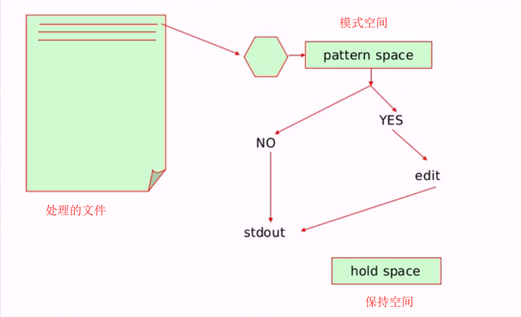

1、每12小时备份并压缩/etc/目录至/backup目录中，保存文件名称格式为，"etc-年-月-日-时-分.tar.gz"

### 步骤1：确保`crond`守护进程处于运行状态：

```
~]# systemctl status crond.service
```

### 步骤2：编辑脚本文件`/root/etc_backup.sh`：

```
#!/bin/bash
#Version: 0.0.1
#Author: Paul
#Description: backup /etc to /backup

[ ! -d /backup ] && /usr/bin/mkdir /backup

datetime=$(/usr/bin/date '+%Y-%m-%d-%H-%M')

/usr/bin/tar zcf /backup/etc-$datetime.tar.gz /etc &> /dev/null
```

### 步骤3：编写周期性任务计划：

```
~]# crontab -e

0 */12 * * * /usr/bin/bash /root/etc_backup.sh > /dev/null
```

> ```
> [root@localhost ~]# systemctl status crond.service 
> crond.service - Command Scheduler
>    Loaded: loaded (/usr/lib/systemd/system/crond.service; enabled)
>    Active: active (running) since Fri 2019-04-19 08:34:48 EDT; 1 day 3h ago
>  Main PID: 1270 (crond)
>    CGroup: /system.slice/crond.service
>            └─1270 /usr/sbin/crond -n
> 
> Apr 19 08:34:48 localhost.localdomain systemd[1]: Started Command Scheduler.
> Apr 19 08:34:49 localhost.localdomain crond[1270]: (CRON) INFO (RANDOM_DELAY will be scaled with factor 45% if used.)
> Apr 19 08:34:49 localhost.localdomain crond[1270]: (CRON) INFO (running with inotify support)
> [root@localhost ~]# vim etc_backup.sh
> [root@localhost ~]# bash -n etc_backup.sh
> [root@localhost ~]# bash -x etc_backup.sh 
> + '[' '!' -d /backup ']'
> + /usr/bin/mkdir /backup
> ++ /usr/bin/date +%Y-%m-%d-%H-%M
> + datetime=2019-04-20-12-34
> + /usr/bin/tar zcf /backup/etc-2019-04-20-12-34.tar.gz /etc
> [root@localhost ~]# 
> [root@localhost ~]# ls /backup/
> etc-2019-04-20-12-34.tar.gz
> [root@localhost ~]# tar tf /backup/etc-2019-04-20-12-34.tar.gz | less
> etc/
> etc/fstab
> etc/crypttab
> etc/mtab
> etc/resolv.conf
> etc/fonts/
> etc/fonts/conf.d/
> etc/fonts/conf.d/65-0-lohit-nepali.conf
> etc/fonts/conf.d/59-liberation-sans.conf
> etc/fonts/conf.d/66-sil-abyssinica.conf
> etc/fonts/conf.d/59-liberation-mono.conf
> etc/fonts/conf.d/31-cantarell.conf
> etc/fonts/conf.d/20-unhint-small-dejavu-serif.conf
> etc/fonts/conf.d/10-scale-bitmap-fonts.conf
> etc/fonts/conf.d/57-dejavu-serif.conf
> etc/fonts/conf.d/20-unhint-small-vera.conf
> etc/fonts/conf.d/66-sil-nuosu.conf
> etc/fonts/conf.d/25-no-bitmap-fedora.conf
> etc/fonts/conf.d/57-paratype-pt-sans.conf
> etc/fonts/conf.d/25-unhint-nonlatin.conf
> etc/fonts/conf.d/65-0-jomolhari.conf
> etc/fonts/conf.d/30-metric-aliases.conf
> etc/fonts/conf.d/30-urw-aliases.conf
> etc/fonts/conf.d/40-nonlatin.conf
> etc/fonts/conf.d/45-latin.conf
> etc/fonts/conf.d/49-sansserif.conf
> etc/fonts/conf.d/50-user.conf
> etc/fonts/conf.d/51-local.conf
> etc/fonts/conf.d/60-latin.conf
> etc/fonts/conf.d/65-sil-padauk.conf
> etc/fonts/conf.d/65-fonts-persian.conf
> etc/fonts/conf.d/65-nonlatin.conf
> etc/fonts/conf.d/69-unifont.conf
> etc/fonts/conf.d/80-delicious.conf
> etc/fonts/conf.d/90-synthetic.conf
> etc/fonts/conf.d/README
> etc/fonts/conf.d/69-gnu-free-serif.conf
> etc/fonts/conf.d/65-0-lohit-punjabi.conf
> etc/fonts/conf.d/60-overpass.conf
> etc/fonts/conf.d/65-1-vlgothic-gothic.conf
> etc/fonts/conf.d/65-0-lohit-devanagari.conf
> etc/fonts/conf.d/20-unhint-small-dejavu-sans.conf
> etc/fonts/conf.d/57-dejavu-sans.conf
> etc/fonts/conf.d/60-open-sans.conf
> etc/fonts/conf.d/65-0-paktype-naskh-basic.conf
> etc/fonts/conf.d/65-0-smc-meera.conf
> etc/fonts/conf.d/65-0-lohit-gujarati.conf
> etc/fonts/conf.d/30-0-google-crosextra-caladea-fontconfig.conf
> etc/fonts/conf.d/57-dejavu-sans-mono.conf
> etc/fonts/conf.d/62-google-crosextra-caladea-fontconfig.conf
> etc/fonts/conf.d/65-0-ttf-arphic-uming.conf
> etc/fonts/conf.d/65-0-madan.conf
> etc/fonts/conf.d/90-ttf-arphic-uming-embolden.conf
> etc/fonts/conf.d/61-stix.conf
> etc/fonts/conf.d/65-0-wqy-zenhei-sharp.conf
> etc/fonts/conf.d/67-lohit-malayalam.conf
> etc/fonts/conf.d/59-liberation-serif.conf
> :
> [root@localhost ~]# rm -rf /backup
> [root@localhost ~]# crontab -e
> [root@localhost ~]# crontab -l
> 0 */12 * * * /usr/bin/bash /root/etc_backup.sh > /dev/null
> [root@localhost ~]# 
> ```

# 2、rpm包管理功能总结以及实例应用演示

### rpm命令管理程序包的几个基本功能：

> 安装、升级、卸载、查询和校验、数据库维护

### rpm命令：`rpm [OPTIONS] [PACKAGE_FILE | PACKAGE]`

> 安装：`-i, --install`
>
> 升级：`-U, --update, -F, --freshen`
>
> 卸载：`-e, --erase`
>
> 查询：`-q, --query`
>
> 校验：`-V, --verify`
>
> 数据库维护：`--builddb, --initdb`

#### 安装：

> `rpm {-i|--install} [install-options] PACKAGE_FILE ...`
>
> ​	GENERAL OPTIONS：
>
> ​		`-v`: verbose, 详细信息
>
> ​		`-vv`: 更详细的输出
>
> ​	[install-options]：
>
> ​		`-h`: hash marks输出进度条；每个#表示2%的进度；
>
> ​		`--test`: 测试安装，检查并报告依赖关系及冲突消息等；
>
> ​		`--nodeps`: 忽略依赖关系；不建议；
>
> ​		`--replacepkgs`: 重新安装；
>
> **综合以上，所以一般使用的安装命令是**：`rpm -ivh PACKAGE_FILE ...`
>
> ```
> [root@localhost ~]# cd /mnt/Packages/
> [root@localhost Packages]# ls | grep "^zsh\>"
> zsh-5.0.2-7.el7.x86_64.rpm
> zsh-html-5.0.2-7.el7.x86_64.rpm
> [root@localhost Packages]# cat /etc/shells
> /bin/sh
> /bin/bash
> /sbin/nologin
> /usr/bin/sh
> /usr/bin/bash
> /usr/sbin/nologin
> /bin/tcsh
> /bin/csh
> [root@localhost Packages]# rpm -ivh zsh-5.0.2-7.el7.x86_64.rpm 
> Preparing...                          ################################# [100%]
> Updating / installing...
>    1:zsh-5.0.2-7.el7                  ################################# [100%]
> [root@localhost Packages]# cat /etc/shells
> /bin/sh
> /bin/bash
> /sbin/nologin
> /usr/bin/sh
> /usr/bin/bash
> /usr/sbin/nologin
> /bin/tcsh
> /bin/csh
> /bin/zsh
> [root@localhost Packages]# zsh
> [root@localhost]/mnt/Packages# 
> ```
>
> **使用`--test`做测试安装：**
>
> ```
> [root@localhost Packages]# pwd
> /mnt/Packages
> [root@localhost Packages]# rpm -ivh --test zsh-html-5.0.2-7.el7.x86_64.rpm 
> Preparing...                          ################################# [100%]
> [root@localhost Packages]# rpm -ivh --test php-common-5.4.16-23.el7_0.3.x86_64.rpm 
> error: Failed dependencies:
> 	libzip.so.2()(64bit) is needed by php-common-5.4.16-23.el7_0.3.x86_64
> [root@localhost Packages]# 
> ```
>
> **使用`--nodeps`忽略依赖关系安装，但不建议这么操作，可能会导致程序无法正常使用：**
>
> ```
> [root@localhost Packages]# pwd
> /mnt/Packages
> [root@localhost Packages]# rpm -ivh php-common-5.4.16-23.el7_0.3.x86_64.rpm 
> error: Failed dependencies:
> 	libzip.so.2()(64bit) is needed by php-common-5.4.16-23.el7_0.3.x86_64
> [root@localhost Packages]# rpm -ivh --nodeps php-common-5.4.16-23.el7_0.3.x86_64.rpm 
> Preparing...                          ################################# [100%]
> Updating / installing...
>    1:php-common-5.4.16-23.el7_0.3     ################################# [100%]
> [root@localhost Packages]# 
> ```
>
> **使用`--replacepkgs`重新安装程序包：**
>
> ​	如：
>
> ​		1、配置文件做了修改，但忘记修改的内容 想恢复原有配置内容，则可以通过重新安装包来实现；
>
> ​		2、但如果事先不把配置文件删除，重新安装程序包后，配置文件不会被覆盖，会保留之前做过修改的内容；
>
> ​		3、所以需要先把配置文件删除，然后再进行重新安装程序包，这样配置文件就会恢复至原先状态。
>
> ```
> [root@localhost Packages]# tail -4 /etc/zshrc
> _src_etc_profile_d
> 
> unset -f pathmunge _src_etc_profile_d
> 
> [root@localhost Packages]# vim /etc/zshrc
> [root@localhost Packages]# tail -4 /etc/zshrc
> _src_etc_profile							//最后的"_d"被删除了
> 
> unset -f pathmunge _src_etc_profile			  //最后的"_d"被删除了
> 
> [root@localhost Packages]# rpm -ivh --replacepkgs zsh-5.0.2-7.el7.x86_64.rpm 
> Preparing...                          ################################# [100%]
> Updating / installing...
>    1:zsh-5.0.2-7.el7                  ################################# [100%]
> [root@localhost Packages]# tail -4 /etc/zshrc
> _src_etc_profile
> 
> unset -f pathmunge _src_etc_profile
> 
> [root@localhost Packages]# rm /etc/zshrc
> rm: remove regular file ‘/etc/zshrc’? y
> [root@localhost Packages]# rpm -ivh --replacepkgs zsh-5.0.2-7.el7.x86_64.rpm 
> Preparing...                          ################################# [100%]
> Updating / installing...
>    1:zsh-5.0.2-7.el7                  ################################# [100%]
> [root@localhost Packages]# tail -4 /etc/zshrc
> _src_etc_profile_d
> 
> unset -f pathmunge _src_etc_profile_d					//配置文件是新生成的
> 
> [root@localhost Packages]# 
> ```
>
> ------
>
> **注意：`rpm`可以自带脚本，有以下四类：**
>
> ​	`preinstall`: 安装过程开始之前运行的脚本，`%pre`；不想执行此脚本使用：`--nopre`
>
> ​	`postinstall`: 安装过程完成之后运行的脚本，`%post`；不想执行此脚本使用：`--nopost`
>
> ​	`preuninstall`: 卸载过程真正开始执行之前运行的脚本，`%preun`；不想执行此脚本使用：`--nopreun`
>
> ​	`postuninstall`: 卸载过程完成之后运行的脚本，`%postun`；不想执行此脚本使用：`--nopostun`
>
> ​	如果以上四类脚本都不想执行，可使用：`--noscripts`
>
> ------
>
> **[install-options]  还有另外两个选项：**
>
> ​	`--nosignature`: 不检查包签名信息，不检查来源合法性；
>
> ​	`--nodigest`:	不检查包完整性信息；

#### 升级：

> `rpm {-U|--upgrade} [install-options] PACKAGE_FILE ...`
>
> `rpm {-F|--freshen} [install-options] PACKAGE_FILE ...`
>
> ​	`-U`：升级或安装；即如果已安装过旧版本程序包，则做升级操作，否则为新安装此版本程序包；
>
> ​	`-F`：升级；必须已安装过旧版本程序包，才能做升级操作；
>
> **一般使用的升级命令为：**
>
> ​	`rpm -Uvh PACKAGE_FILE ...	||	rpm -Fvh PACKAGE_FILE ...`
>
> **相比较于安装，升级有两个额外选项：**
>
> ​	`--oldpackage`: 降级；
>
> ​	`--force`: 强制升级；
>
> **注意：**
>
> (1) 不要对内核做升级操作；Linux支持多内核版本并存，因此，直接安装新版本内核；
>
> (2) 如果某原程序包的配置文件安装后曾被修改过，升级时，新版本的程序提供的同一个配置文件不会覆盖原有版本的配置文件，而是把新版本的配置文件重命名(`FILENAME.rpmnew`)后提供。
>
> **示例：对老版本的`zsh`程序包做升级操作：**
>
> ```
> [root@localhost ~]# ls /mnt/Packages/ | grep "^zsh\>"
> zsh-5.0.2-7.el7.x86_64.rpm
> zsh-html-5.0.2-7.el7.x86_64.rpm
> [root@localhost ~]# ls
> 1.txt  anaconda-ks.cfg  etc_backup.sh  fstab  functions  grub2.cfg  initadd.sh  initial-setup-ks.cfg  inittab  sysinfo.sh  zsh-5.0.2-31.el7.x86_64.rpm
> [root@localhost ~]# rpm -Uvh zsh-5.0.2-31.el7.x86_64.rpm 
> Preparing...                          ################################# [100%]
> Updating / installing...
>    1:zsh-5.0.2-31.el7                 ################################# [ 50%]
> Cleaning up / removing...
>    2:zsh-5.0.2-7.el7                  ################################# [100%]
> [root@localhost ~]# 
> ```

#### 卸载：

> `rpm {-e|--erase} [--allmatches] [--nodeps] [--noscripts] [--test] PACKAGE_NAME ...`
>
> ​		<u>此处要注意卸载时使用的是包名</u>
>
> ​	`--allmatches`: 卸载所有匹配指定名称的程序包的各版本；
>
> ​	`--nodeps`: 忽略依赖关系；
>
> ​	`--noscripts`：不执行脚本；
>
> ​	`--test`: 测试卸载，dry run模式；
>
> **示例：直接使用`-e`选项对`zsh`程序包做卸载操作：**
>
> ```
> [root@localhost ~]# rpm -q zsh				//此处为rpm查询命令，下面会提到
> zsh-5.0.2-31.el7.x86_64
> [root@localhost ~]# rpm -e zsh
> [root@localhost ~]# rpm -q zsh
> package zsh is not installed
> [root@localhost ~]# 
> ```

#### 查询：

> `rpm {-q|--query} [select-options] [query-options]`

##### [select-options]

###### `PACKAGE_NAME`: 

> 查询指定的程序包是否已经安装，及其版本；
>

> ```
> [root@localhost ~]# rpm -q zsh
> package zsh is not installed
> [root@localhost ~]# ls 
> 1.txt  anaconda-ks.cfg  etc_backup.sh  fstab  functions  grub2.cfg  initadd.sh  initial-setup-ks.cfg  inittab  sysinfo.sh  zsh-5.0.2-31.el7.x86_64.rpm
> [root@localhost ~]# rpm -ivh zsh-5.0.2-31.el7.x86_64.rpm 
> Preparing...                          ################################# [100%]
> Updating / installing...
>    1:zsh-5.0.2-31.el7                 ################################# [100%]
> [root@localhost ~]# rpm -q zsh
> zsh-5.0.2-31.el7.x86_64
> [root@localhost ~]# 
> ```

###### `-a, --all`：

> 查询所有已经安装过的包；
>

> ```
> [root@localhost ~]# rpm -qa
> ... ...
> python-ethtool-0.8-5.el7.x86_64
> libsoup-2.46.0-3.el7.x86_64
> tar-1.26-29.el7.x86_64
> kwallet-4.10.5-3.el7.x86_64
> iwl2000-firmware-18.168.6.1-36.el7.noarch
> audit-libs-python-2.4.1-5.el7.x86_64
> hypervvssd-0-0.25.20141008git.el7.x86_64
> libss-1.42.9-7.el7.x86_64
> ark-libs-4.10.5-4.el7.x86_64
> iwl135-firmware-18.168.6.1-36.el7.noarch
> deltarpm-3.6-3.el7.x86_64
> cryptsetup-python-1.6.6-3.el7.x86_64
> boost-system-1.53.0-23.el7.x86_64
> kgpg-4.10.5-4.el7.x86_64
> libmpc-1.0.1-3.el7.x86_64
> libreport-rhel-anaconda-bugzilla-2.1.11-21.el7.centos.0.4.x86_64
> glusterfs-libs-3.6.0.29-2.el7.x86_64
> yajl-2.0.4-4.el7.x86_64
> kdenetwork-krfb-libs-4.10.5-8.el7_0.x86_64
> libreport-anaconda-2.1.11-21.el7.centos.0.4.x86_64
> rpm-python-4.11.1-25.el7.x86_64
> newt-0.52.15-4.el7.x86_64
> kde-workspace-4.10.5-21.el7.x86_64
> rubygems-2.0.14-24.el7.noarch
> ipa-python-4.1.0-18.el7.centos.0.1.x86_64
> boost-thread-1.53.0-23.el7.x86_64
> mutter-3.8.4-16.el7.x86_64
> pykickstart-1.99.43.17-1.el7.noarch
> cups-filters-libs-1.0.35-15.el7_0.1.x86_64
> perl-parent-0.225-244.el7.noarch
> [root@localhost ~]#
> [root@localhost ~]# rpm -qa | grep "^zs"
> zsh-5.0.2-31.el7.x86_64
> [root@localhost ~]# rpm -qa | grep "^z"
> zlib-1.2.7-13.el7.x86_64
> zenity-3.8.0-4.el7.x86_64
> zsh-5.0.2-31.el7.x86_64
> zip-3.0-10.el7.x86_64
> [root@localhost ~]# 
> ```

###### `-f FILE`：

> 查询指定文件由哪个程序包安装生成；
>

> ```
> [root@localhost ~]# rpm -qf /etc/fstab 
> setup-2.8.71-5.el7.noarch
> [root@localhost ~]# 
> ```

###### `-p, --package PACKAGE_FILE`：

> 用于实现对未安装的程序包执行查询操作；
>

> ```
> [root@localhost ~]# rpm -q zsh
> package zsh is not installed
> [root@localhost ~]# ls
> 1.txt  anaconda-ks.cfg  etc_backup.sh  fstab  functions  grub2.cfg  initadd.sh  initial-setup-ks.cfg  inittab  sysinfo.sh  zsh-5.0.2-31.el7.x86_64.rpm
> [root@localhost ~]# rpm -qpl zsh-5.0.2-31.el7.x86_64.rpm 
> ... ...
> /usr/share/zsh/5.0.2/functions/zfhere
> /usr/share/zsh/5.0.2/functions/zfinit
> /usr/share/zsh/5.0.2/functions/zfls
> /usr/share/zsh/5.0.2/functions/zfmark
> /usr/share/zsh/5.0.2/functions/zfopen
> /usr/share/zsh/5.0.2/functions/zfparams
> /usr/share/zsh/5.0.2/functions/zfpcp
> /usr/share/zsh/5.0.2/functions/zfput
> /usr/share/zsh/5.0.2/functions/zfrglob
> /usr/share/zsh/5.0.2/functions/zfrtime
> /usr/share/zsh/5.0.2/functions/zfsession
> /usr/share/zsh/5.0.2/functions/zfstat
> /usr/share/zsh/5.0.2/functions/zftp_chpwd
> /usr/share/zsh/5.0.2/functions/zftp_progress
> /usr/share/zsh/5.0.2/functions/zftransfer
> /usr/share/zsh/5.0.2/functions/zftype
> /usr/share/zsh/5.0.2/functions/zfuget
> /usr/share/zsh/5.0.2/functions/zfuput
> /usr/share/zsh/5.0.2/functions/zkbd
> /usr/share/zsh/5.0.2/functions/zmathfuncdef
> /usr/share/zsh/5.0.2/functions/zmv
> /usr/share/zsh/5.0.2/functions/zrecompile
> /usr/share/zsh/5.0.2/functions/zsh-mime-contexts
> /usr/share/zsh/5.0.2/functions/zsh-mime-handler
> /usr/share/zsh/5.0.2/functions/zsh-mime-setup
> /usr/share/zsh/5.0.2/functions/zsh-newuser-install
> /usr/share/zsh/5.0.2/functions/zsh_directory_name_cdr
> /usr/share/zsh/5.0.2/functions/zstyle+
> /usr/share/zsh/5.0.2/functions/ztodo
> /usr/share/zsh/5.0.2/scripts
> /usr/share/zsh/5.0.2/scripts/newuser
> /usr/share/zsh/site-functions
> [root@localhost ~]# rpm -qpi zsh-5.0.2-31.el7.x86_64.rpm 
> Name        : zsh
> Version     : 5.0.2
> Release     : 31.el7
> Architecture: x86_64
> Install Date: (not installed)
> Group       : System Environment/Shells
> Size        : 5854390
> License     : MIT
> Signature   : RSA/SHA256, Mon 12 Nov 2018 09:49:55 AM EST, Key ID 24c6a8a7f4a80eb5
> Source RPM  : zsh-5.0.2-31.el7.src.rpm
> Build Date  : Tue 30 Oct 2018 12:48:17 PM EDT
> Build Host  : x86-01.bsys.centos.org
> Relocations : (not relocatable)
> Packager    : CentOS BuildSystem <http://bugs.centos.org>
> Vendor      : CentOS
> URL         : http://zsh.sourceforge.net/
> Summary     : Powerful interactive shell
> Description :
> The zsh shell is a command interpreter usable as an interactive login
> shell and as a shell script command processor.  Zsh resembles the ksh
> shell (the Korn shell), but includes many enhancements.  Zsh supports
> command line editing, built-in spelling correction, programmable
> command completion, shell functions (with autoloading), a history
> mechanism, and more.
> [root@localhost ~]# rpm -qpc zsh-5.0.2-31.el7.x86_64.rpm 
> /etc/skel/.zshrc
> /etc/zlogin
> /etc/zlogout
> /etc/zprofile
> /etc/zshenv
> /etc/zshrc
> [root@localhost ~]# rpm -qpd zsh-5.0.2-31.el7.x86_64.rpm 
> /usr/share/doc/zsh-5.0.2/BUGS
> /usr/share/doc/zsh-5.0.2/CONTRIBUTORS
> /usr/share/doc/zsh-5.0.2/FAQ
> /usr/share/doc/zsh-5.0.2/FEATURES
> /usr/share/doc/zsh-5.0.2/LICENCE
> /usr/share/doc/zsh-5.0.2/MACHINES
> /usr/share/doc/zsh-5.0.2/NEWS
> /usr/share/doc/zsh-5.0.2/README
> /usr/share/doc/zsh-5.0.2/completion-style-guide
> /usr/share/doc/zsh-5.0.2/zsh-development-guide
> /usr/share/doc/zsh-5.0.2/zshprompt.pl
> /usr/share/info/zsh.info-1.gz
> /usr/share/info/zsh.info-2.gz
> /usr/share/info/zsh.info-3.gz
> /usr/share/info/zsh.info-4.gz
> /usr/share/info/zsh.info-5.gz
> /usr/share/info/zsh.info.gz
> /usr/share/man/man1/zsh.1.gz
> /usr/share/man/man1/zshall.1.gz
> /usr/share/man/man1/zshbuiltins.1.gz
> /usr/share/man/man1/zshcalsys.1.gz
> /usr/share/man/man1/zshcompctl.1.gz
> /usr/share/man/man1/zshcompsys.1.gz
> /usr/share/man/man1/zshcompwid.1.gz
> /usr/share/man/man1/zshcontrib.1.gz
> /usr/share/man/man1/zshexpn.1.gz
> /usr/share/man/man1/zshmisc.1.gz
> /usr/share/man/man1/zshmodules.1.gz
> /usr/share/man/man1/zshoptions.1.gz
> /usr/share/man/man1/zshparam.1.gz
> /usr/share/man/man1/zshroadmap.1.gz
> /usr/share/man/man1/zshtcpsys.1.gz
> /usr/share/man/man1/zshzftpsys.1.gz
> /usr/share/man/man1/zshzle.1.gz
> [root@localhost ~]# rpm -qp --scripts  zsh-5.0.2-31.el7.x86_64.rpm 
> postinstall scriptlet (using /bin/sh):
> if [ ! -f /etc/shells ] ; then
>     echo "/bin/zsh" > /etc/shells
> else
>     grep -q "^/bin/zsh$" /etc/shells || echo "/bin/zsh" >> /etc/shells
> fi
> 
> if [ -f /usr/share/info/zsh.info.gz ]; then
> # This is needed so that --excludedocs works.
> /sbin/install-info /usr/share/info/zsh.info.gz /usr/share/info/dir \
>   --entry="* zsh: (zsh).			An enhanced bourne shell."
> fi
> 
> :
> preuninstall scriptlet (using /bin/sh):
> if [ "$1" = 0 ] ; then
>     if [ -f /usr/share/info/zsh.info.gz ]; then
>     # This is needed so that --excludedocs works.
>     /sbin/install-info --delete /usr/share/info/zsh.info.gz /usr/share/info/dir \
>       --entry="* zsh: (zsh).			An enhanced bourne shell."
>     fi
> fi
> :
> postuninstall scriptlet (using /bin/sh):
> if [ "$1" = 0 ] ; then
>     if [ -f /etc/shells ] ; then
>         TmpFile=`/bin/mktemp /tmp/.zshrpmXXXXXX`
>         grep -v '^/bin/zsh$' /etc/shells > $TmpFile
>         cp -f $TmpFile /etc/shells
>         rm -f $TmpFile
>     fi
> fi
> [root@localhost ~]# 
> ```


###### `--whatprovides CAPABILITY`：

> 查询指定的CAPABILITY由哪个程序包提供；
>

> ```
> [root@localhost ~]# rpm -q --whatprovides bash					//表示CAPABILITY：bash和config(bash)，都是由bash这个程序包提供
> bash-4.2.46-12.el7.x86_64
> [root@localhost ~]# rpm -q --whatprovides 'config(bash)'
> bash-4.2.46-12.el7.x86_64
> [root@localhost ~]# 
> ```

###### `--whatrequires CAPABILITY`：

> 查询指定的CAPABILITY被哪个包所依赖；
>

> ```
> [root@localhost ~]# rpm -q --whatrequires bash        //表示哪些包依赖于bash这个CAPABILITY
> initscripts-9.49.24-1.el7.x86_64
> dracut-033-240.el7.x86_64
> lvm2-2.02.115-3.el7.x86_64
> autofs-5.0.7-48.el7.x86_64
> mariadb-5.5.41-2.el7_0.x86_64
> rsyslog-7.4.7-7.el7_0.x86_64
> jline-1.0-8.el7.noarch
> kpatch-0.1.10-4.el7.noarch
> bash-completion-2.1-6.el7.noarch
> [root@localhost ~]# 
> ```

##### [query-options]

###### `--changelog`：

> 查询rpm包的changelog；
>

> ```
> [root@localhost ~]# rpm -q --changelog zsh
> ... ...
> * Fri Aug 07 2009 James Antill <james@fedoraproject.org> - 4.3.10-4
> - Allow --excludedocs command to work!
> - Resolves: bug#515986
> 
> * Mon Jul 27 2009 Fedora Release Engineering <rel-eng@lists.fedoraproject.org> - 4.3.10-3
> - Rebuilt for https://fedoraproject.org/wiki/Fedora_12_Mass_Rebuild
> 
> * Mon Jul 20 2009 James Antill <james@fedoraproject.org> - 4.3.10-1
> - Import new upstream 4.3.10
> 
> * Wed Jun 10 2009 Karsten Hopp <karsten@redhat.com> 4.3.9-4.1
> - skip D02glob test on s390, too
> 
> * Mon Mar 02 2009 James Antill <james@fedoraproject.org> - 4.3.9-4
> - Remove D02glob testcase on ppc/ppc64, and hope noone cares
> 
> * Wed Feb 25 2009 Fedora Release Engineering <rel-eng@lists.fedoraproject.org> - 4.3.9-2
> - Rebuilt for https://fedoraproject.org/wiki/Fedora_11_Mass_Rebuild
> 
> [root@localhost ~]# 
> ```

###### `-l, --list`：

> 程序安装生成的所有文件列表；
>

> ```
> [root@localhost ~]# rpm -ql bash
> ... ...
> /usr/share/man/man1/popd.1.gz
> /usr/share/man/man1/pushd.1.gz
> /usr/share/man/man1/read.1.gz
> /usr/share/man/man1/readonly.1.gz
> /usr/share/man/man1/return.1.gz
> /usr/share/man/man1/set.1.gz
> /usr/share/man/man1/sh.1.gz
> /usr/share/man/man1/shift.1.gz
> /usr/share/man/man1/shopt.1.gz
> /usr/share/man/man1/source.1.gz
> /usr/share/man/man1/suspend.1.gz
> /usr/share/man/man1/times.1.gz
> /usr/share/man/man1/trap.1.gz
> /usr/share/man/man1/type.1.gz
> /usr/share/man/man1/typeset.1.gz
> /usr/share/man/man1/ulimit.1.gz
> /usr/share/man/man1/umask.1.gz
> /usr/share/man/man1/unalias.1.gz
> /usr/share/man/man1/unset.1.gz
> /usr/share/man/man1/wait.1.gz
> [root@localhost ~]# rpm -ql bash | wc -l
> 109
> [root@localhost ~]# 
> ```

###### `-i, --info`：

> 程序包相关的信息，版本号、大小、所属的包组，等；
>

> ```
> [root@localhost ~]# rpm -qi bash
> Name        : bash
> Version     : 4.2.46
> Release     : 12.el7
> Architecture: x86_64
> Install Date: Wed 20 Mar 2019 06:41:17 PM EDT
> Group       : System Environment/Shells
> Size        : 3663626
> License     : GPLv3+
> Signature   : RSA/SHA256, Sat 14 Mar 2015 03:39:08 AM EDT, Key ID 24c6a8a7f4a80eb5
> Source RPM  : bash-4.2.46-12.el7.src.rpm
> Build Date  : Thu 05 Mar 2015 05:09:15 PM EST
> Build Host  : worker1.bsys.centos.org
> Relocations : (not relocatable)
> Packager    : CentOS BuildSystem <http://bugs.centos.org>
> Vendor      : CentOS
> URL         : http://www.gnu.org/software/bash
> Summary     : The GNU Bourne Again shell
> Description :
> The GNU Bourne Again shell (Bash) is a shell or command language
> interpreter that is compatible with the Bourne shell (sh). Bash
> incorporates useful features from the Korn shell (ksh) and the C shell
> (csh). Most sh scripts can be run by bash without modification.
> [root@localhost ~]# 
> ```

###### `-c, --configfiles`：

> 查询指定的程序提供的配置文件；
>

> ```
> [root@localhost ~]# rpm -qc bash
> /etc/skel/.bash_logout
> /etc/skel/.bash_profile
> /etc/skel/.bashrc
> [root@localhost ~]# rpm -qc zsh
> /etc/skel/.zshrc
> /etc/zlogin
> /etc/zlogout
> /etc/zprofile
> /etc/zshenv
> /etc/zshrc
> [root@localhost ~]# 
> ```

###### `-d, --docfiles`：

> 查询指定的程序包提供的文档；
>

> ```
> [root@localhost ~]# rpm -qd bash
> /usr/share/doc/bash-4.2.46/COPYING
> /usr/share/info/bash.info.gz
> /usr/share/man/man1/..1.gz
> /usr/share/man/man1/:.1.gz
> /usr/share/man/man1/[.1.gz
> /usr/share/man/man1/alias.1.gz
> /usr/share/man/man1/bash.1.gz
> /usr/share/man/man1/bashbug-64.1.gz
> /usr/share/man/man1/bashbug.1.gz
> /usr/share/man/man1/bg.1.gz
> /usr/share/man/man1/bind.1.gz
> /usr/share/man/man1/break.1.gz
> /usr/share/man/man1/builtin.1.gz
> /usr/share/man/man1/builtins.1.gz
> /usr/share/man/man1/caller.1.gz
> /usr/share/man/man1/cd.1.gz
> /usr/share/man/man1/command.1.gz
> /usr/share/man/man1/compgen.1.gz
> /usr/share/man/man1/complete.1.gz
> /usr/share/man/man1/compopt.1.gz
> /usr/share/man/man1/continue.1.gz
> /usr/share/man/man1/declare.1.gz
> /usr/share/man/man1/dirs.1.gz
> /usr/share/man/man1/disown.1.gz
> /usr/share/man/man1/enable.1.gz
> /usr/share/man/man1/eval.1.gz
> /usr/share/man/man1/exec.1.gz
> /usr/share/man/man1/exit.1.gz
> /usr/share/man/man1/export.1.gz
> /usr/share/man/man1/fc.1.gz
> /usr/share/man/man1/fg.1.gz
> /usr/share/man/man1/getopts.1.gz
> /usr/share/man/man1/hash.1.gz
> /usr/share/man/man1/help.1.gz
> /usr/share/man/man1/history.1.gz
> /usr/share/man/man1/jobs.1.gz
> /usr/share/man/man1/let.1.gz
> /usr/share/man/man1/local.1.gz
> /usr/share/man/man1/logout.1.gz
> /usr/share/man/man1/mapfile.1.gz
> /usr/share/man/man1/popd.1.gz
> /usr/share/man/man1/pushd.1.gz
> /usr/share/man/man1/read.1.gz
> /usr/share/man/man1/readonly.1.gz
> /usr/share/man/man1/return.1.gz
> /usr/share/man/man1/set.1.gz
> /usr/share/man/man1/sh.1.gz
> /usr/share/man/man1/shift.1.gz
> /usr/share/man/man1/shopt.1.gz
> /usr/share/man/man1/source.1.gz
> /usr/share/man/man1/suspend.1.gz
> /usr/share/man/man1/times.1.gz
> /usr/share/man/man1/trap.1.gz
> /usr/share/man/man1/type.1.gz
> /usr/share/man/man1/typeset.1.gz
> /usr/share/man/man1/ulimit.1.gz
> /usr/share/man/man1/umask.1.gz
> /usr/share/man/man1/unalias.1.gz
> /usr/share/man/man1/unset.1.gz
> /usr/share/man/man1/wait.1.gz
> [root@localhost ~]# 
> ```

###### `--provides`：

> 列出指定的程序包提供的所有的CAPABILITY；
>

> ```
> [root@localhost ~]# rpm -q --provides bash
> /bin/bash
> /bin/sh
> bash = 4.2.46-12.el7
> bash(x86-64) = 4.2.46-12.el7
> config(bash) = 4.2.46-12.el7
> [root@localhost ~]# rpm -q --provides zsh
> config(zsh) = 5.0.2-31.el7
> zsh = 5.0.2-31.el7
> zsh(x86-64) = 5.0.2-31.el7
> [root@localhost ~]# 
> ```

###### `-R, --requires`：

> 查询指定的程序包的依赖关系；
>

> ```
> [root@localhost ~]# rpm -q --requires bash			//表示 bash程序包依赖于哪些CAPABILITY
> /bin/sh
> config(bash) = 4.2.46-12.el7
> libc.so.6()(64bit)
> libc.so.6(GLIBC_2.11)(64bit)
> libc.so.6(GLIBC_2.14)(64bit)
> libc.so.6(GLIBC_2.15)(64bit)
> libc.so.6(GLIBC_2.2.5)(64bit)
> libc.so.6(GLIBC_2.3)(64bit)
> libc.so.6(GLIBC_2.3.4)(64bit)
> libc.so.6(GLIBC_2.4)(64bit)
> libc.so.6(GLIBC_2.8)(64bit)
> libdl.so.2()(64bit)
> libdl.so.2(GLIBC_2.2.5)(64bit)
> libtinfo.so.5()(64bit)
> rpmlib(BuiltinLuaScripts) <= 4.2.2-1
> rpmlib(CompressedFileNames) <= 3.0.4-1
> rpmlib(FileDigests) <= 4.6.0-1
> rpmlib(PayloadFilesHavePrefix) <= 4.0-1
> rtld(GNU_HASH)
> rpmlib(PayloadIsXz) <= 5.2-1
> [root@localhost ~]# 
> ```

###### `--scripts`：

> 查看程序包自带的脚本片断；
>

> ```
> [root@localhost ~]# rpm -q --scripts bash
> postinstall scriptlet (using <lua>):
> nl        = '\n'
> sh        = '/bin/sh'..nl
> bash      = '/bin/bash'..nl
> f = io.open('/etc/shells', 'a+')
> if f then
>   local shells = nl..f:read('*all')..nl
>   if not shells:find(nl..sh) then f:write(sh) end
>   if not shells:find(nl..bash) then f:write(bash) end
>   f:close()
> end
> postuninstall scriptlet (using <lua>):
> -- Run it only if we are uninstalling
> if arg[2] == "0"
> then
>   t={}
>   for line in io.lines("/etc/shells")
>   do
>     if line ~= "/bin/bash" and line ~= "/bin/sh"
>     then
>       table.insert(t,line)
>     end
>   end
> 
>   f = io.open("/etc/shells", "w+")
>   for n,line in pairs(t)
>   do
>     f:write(line.."\n")
>   end
>   f:close()
> end
> [root@localhost ~]# 
> ```

#### 校验：

> `rpm {-V|--verify} [select-options] [verify-options]`

>        ```
>        --nodeps
>               Don't verify dependencies of packages.
>        
>        --nodigest
>               Don't verify package or header digests when reading.
>        
>        --nofiles
>               Don't verify any attributes of package files.
>        
>        --noscripts
>               Don't execute the %verifyscript scriptlet (if any).
>        
>        --nosignature
>               Don't verify package or header signatures when reading.
>        ```

> 		    ```
> 		    	S file Size differs
> 		    	M Mode differs (includes permissions and file type)
> 		    	5 digest (formerly MD5 sum) differs
> 		    	D Device major/minor number mismatch
> 		    	L readLink(2) path mismatch
> 		    	U User ownership differs
> 		    	G Group ownership differs
> 		    	T mTime differs
> 		    	P caPabilities differ
> ```

> ```
> [root@localhost ~]# rpm -q zsh
> package zsh is not installed
> [root@localhost ~]# rpm -ivh zsh-5.0.2-31.el7.x86_64.rpm 
> Preparing...                          ################################# [100%]
> Updating / installing...
>    1:zsh-5.0.2-31.el7                 ################################# [100%]
> [root@localhost ~]# rpm -V zsh
> [root@localhost ~]# rpm -ql zsh
> ... ...
> /usr/share/zsh/5.0.2/functions/zfput
> /usr/share/zsh/5.0.2/functions/zfrglob
> /usr/share/zsh/5.0.2/functions/zfrtime
> /usr/share/zsh/5.0.2/functions/zfsession
> /usr/share/zsh/5.0.2/functions/zfstat
> /usr/share/zsh/5.0.2/functions/zftp_chpwd
> /usr/share/zsh/5.0.2/functions/zftp_progress
> /usr/share/zsh/5.0.2/functions/zftransfer
> /usr/share/zsh/5.0.2/functions/zftype
> /usr/share/zsh/5.0.2/functions/zfuget
> /usr/share/zsh/5.0.2/functions/zfuput
> /usr/share/zsh/5.0.2/functions/zkbd
> /usr/share/zsh/5.0.2/functions/zmathfuncdef
> /usr/share/zsh/5.0.2/functions/zmv
> /usr/share/zsh/5.0.2/functions/zrecompile
> /usr/share/zsh/5.0.2/functions/zsh-mime-contexts
> /usr/share/zsh/5.0.2/functions/zsh-mime-handler
> /usr/share/zsh/5.0.2/functions/zsh-mime-setup
> /usr/share/zsh/5.0.2/functions/zsh-newuser-install
> /usr/share/zsh/5.0.2/functions/zsh_directory_name_cdr
> /usr/share/zsh/5.0.2/functions/zstyle+
> /usr/share/zsh/5.0.2/functions/ztodo
> /usr/share/zsh/5.0.2/scripts
> /usr/share/zsh/5.0.2/scripts/newuser
> /usr/share/zsh/site-functions
> [root@localhost ~]# file /usr/share/zsh/5.0.2/functions/zfput
> /usr/share/zsh/5.0.2/functions/zfput: ASCII text
> [root@localhost ~]# head -20 /usr/share/zsh/5.0.2/functions/zfput
> # function zfput {
> # Simple put:  dump every file under the same name, but stripping
> # off any directory parts to get the remote filename (i.e. always
> # goes into current remote directory).  Use zfpcp to specify new
> # file name or new directory at remote end.
> #
> # -r means put recursively:  any directories encountered will have
> #    all their contents to arbitrary depth transferred.  Note that
> #    this creates the required directories.  Any files in subdirectories
> #    whose names begin with a `.' will also be included.
> 
> emulate -L zsh
> 
> [[ $curcontext = :zf* ]] || local curcontext=:zfput
> local opt opt_r
> integer stat do_close abort
> 
> while getopts :r opt; do
>   [[ $opt = '?' ]] && print "zfget: bad option: -$OPTARG" && return 1
>   eval "opt_$opt=1"
> [root@localhost ~]# vim /usr/share/zsh/5.0.2/functions/zfput
> [root@localhost ~]# head -20 /usr/share/zsh/5.0.2/functions/zfput
> # function zfput {
> # Simple put:  dump every file under the same name, but stripping
> # off any directory parts to get the remote filename (i.e. always
> # goes into current remote directory).  Use zfpcp to specify new
> # file name or new directory at remote end.
> #
> # -r means put recursively:  any directories encountered will have
> #    all their contents to arbitrary depth transferred.  Note that
> #    this creates the required directories.  Any files in subdirectories
> #    whose names begin with a `.' will also be included.
> #						//多加了一个“#”号
> 
> emulate -L zsh
> 
> [[ $curcontext = :zf* ]] || local curcontext=:zfput
> local opt opt_r
> integer stat do_close abort
> 
> while getopts :r opt; do
>   [[ $opt = '?' ]] && print "zfget: bad option: -$OPTARG" && return 1
> [root@localhost ~]# rpm -V zsh
> S.5....T.    /usr/share/zsh/5.0.2/functions/zfput
> [root@localhost ~]# rpm -V --nofiles zsh
> [root@localhost ~]# 
> ```

#### 数据库重建：

> rpm管理器数据库路径：`/var/lib/rpm/`
>
> ​	查询操作：通过此处的数据库进行；
>
> 获取帮助：
>
> ​	`CentOS 6：man rpm`
>
> ​	`CentOS 7: man rpmdb`
>
> 使用命令：
>
> ​	`rpm {--initdb|--rebuilddb} [--dbpath DIRECTORY] [--root DIRECTORY]`
>
> ​		`--initdb`: 初始化数据库，当前无任何数据库可初始化创建一个新的；当前有时不执行任何操作；
>
> ​		`--rebuilddb`: 重新构建，通过读取当前系统上所有已经安装过的程序包进行重新创建；

> ```
> [root@localhost ~]# mkdir /tmp/rpm
> [root@localhost ~]# rpm --initdb --dbpath=/tmp/rpm
> [root@localhost ~]# ls /tmp/rpm/
> Basenames  Conflictname  __db.001  __db.002  __db.003  Dirnames  Group  Installtid  Name  Obsoletename  Packages  Providename  Requirename  Sha1header  Sigmd5  Triggername
> [root@localhost ~]# rpm --initdb --dbpath=/tmp/rpm
> [root@localhost ~]# ls /tmp/rpm/
> Basenames  Conflictname  __db.001  __db.002  __db.003  Dirnames  Group  Installtid  Name  Obsoletename  Packages  Providename  Requirename  Sha1header  Sigmd5  Triggername
> [root@localhost ~]# rpm --rebuilddb --dbpath=/tmp/rpm
> [root@localhost ~]# ls /tmp/rpm/
> Basenames  Conflictname  Dirnames  Group  Installtid  Name  Obsoletename  Packages  Providename  Requirename  Sha1header  Sigmd5  Triggername
> [root@localhost ~]# 
> ```

# 3、yum的配置和使用总结以及yum私有仓库的创建

### `yum repository: yum repo`

> yum仓库，存储了众多rpm包，以及包的相关的元数据文件(放置于特定目录下：`repodata`)；
>
> 仓库首先要是一个文件服务器，可以通过以下协议来提供服务：
>
> ​	`ftp://, http://, nfs://, file:///`

### yum客户端：

> **配置文件**：`/etc/yum.conf`: 为所有仓库提供公共配置
>
> ​				  `/etc/yum.repos.d/*.repo`：为仓库的指向提供配置
>
> **仓库指向的定义：**
>
> 		[repositoryID]
> 		name=Some name for this repository
> 		baseurl=url://path/to/repository/
> 		enabled={1|0}
> 		gpgcheck={1|0}
> 		gpgkey=URL
> 		enablegroups={1|0}
> 		failovermethod={roundrobin|priority}
> 			默认为：roundrobin, 意为随机挑选；
> 		cost=
> 			默认为1000

### yum命令的用法：

> `yum [options] [command] [package ...]`
>
>        command is one of:
>         * install package1 [package2] [...]
>         * update [package1] [package2] [...]
>         * update-to [package1] [package2] [...]
>         * check-update
>         * upgrade [package1] [package2] [...]
>         * upgrade-to [package1] [package2] [...]
>         * distribution-synchronization [package1] [package2] [...]
>         * remove | erase package1 [package2] [...]
>         * list [...]
>         * info [...]
>         * provides | whatprovides feature1 [feature2] [...]
>         * clean [ packages | metadata | expire-cache | rpmdb | plugins | all ]
>         * makecache
>         * groupinstall group1 [group2] [...]
>         * groupupdate group1 [group2] [...]
>         * grouplist [hidden] [groupwildcard] [...]
>         * groupremove group1 [group2] [...]
>         * groupinfo group1 [...]
>         * search string1 [string2] [...]
>         * shell [filename]
>         * resolvedep dep1 [dep2] [...]
>         * localinstall rpmfile1 [rpmfile2] [...]
>            (maintained for legacy reasons only - use install)
>         * localupdate rpmfile1 [rpmfile2] [...]
>            (maintained for legacy reasons only - use update)
>         * reinstall package1 [package2] [...]
>         * downgrade package1 [package2] [...]
>         * deplist package1 [package2] [...]
>         * repolist [all|enabled|disabled]
>         * version [ all | installed | available | group-* | nogroups* | grouplist | groupinfo ]
>         * history [info|list|packages-list|packages-info|summary|addon-info|redo|undo|rollback|new|sync|stats]
>         * load-transaction [txfile]
>         * check
>         * help [command]

#### 显示仓库列表：

> `repolist [all|enabled|disabled]`

> ```
> [root@localhost yum.repos.d]# yum repolist all
> Loaded plugins: fastestmirror, langpacks
> Loading mirror speeds from cached hostfile
>  * base: mirrors.aliyun.com
>  * extras: mirrors.aliyun.com
>  * updates: mirrors.aliyun.com
> repo id                                                                                                                    repo name                                                                                                                    status
> C7.0.1406-base/x86_64                                                                                                      CentOS-7.0.1406 - Base                                                                                                       disabled
> C7.0.1406-centosplus/x86_64                                                                                                CentOS-7.0.1406 - CentOSPlus                                                                                                 disabled
> C7.0.1406-extras/x86_64                                                                                                    CentOS-7.0.1406 - Extras                                                                                                     disabled
> C7.0.1406-fasttrack/x86_64                                                                                                 CentOS-7.0.1406 - CentOSPlus                                                                                                 disabled
> C7.0.1406-updates/x86_64                                                                                                   CentOS-7.0.1406 - Updates                                                                                                    disabled
> base/7/x86_64                                                                                                              CentOS-7 - Base                                                                                                              enabled: 10,019
> base-debuginfo/x86_64                                                                                                      CentOS-7 - Debuginfo                                                                                                         disabled
> base-source/7                                                                                                              CentOS-7 - Base Sources                                                                                                      disabled
> centosplus/7/x86_64                                                                                                        CentOS-7 - Plus                                                                                                              disabled
> centosplus-source/7                                                                                                        CentOS-7 - Plus Sources                                                                                                      disabled
> cr/7/x86_64                                                                                                                CentOS-7 - cr                                                                                                                disabled
> extras/7/x86_64                                                                                                            CentOS-7 - Extras                                                                                                            enabled:    386
> extras-source/7                                                                                                            CentOS-7 - Extras Sources                                                                                                    disabled
> fasttrack/7/x86_64                                                                                                         CentOS-7 - fasttrack                                                                                                         disabled
> rhel7                                                                                                                      rh7                                                                                                                          enabled:  8,652
> updates/7/x86_64                                                                                                           CentOS-7 - Updates                                                                                                           enabled:  1,573
> updates-source/7                                                                                                           CentOS-7 - Updates Sources                                                                                                   disabled
> repolist: 20,630
> [root@localhost yum.repos.d]# yum repolist disabled
> Loaded plugins: fastestmirror, langpacks
> repo id                                                                                                                            repo name                                                                                                                           
> C7.0.1406-base/x86_64                                                                                                              CentOS-7.0.1406 - Base                                                                                                              
> C7.0.1406-centosplus/x86_64                                                                                                        CentOS-7.0.1406 - CentOSPlus                                                                                                        
> C7.0.1406-extras/x86_64                                                                                                            CentOS-7.0.1406 - Extras                                                                                                            
> C7.0.1406-fasttrack/x86_64                                                                                                         CentOS-7.0.1406 - CentOSPlus                                                                                                        
> C7.0.1406-updates/x86_64                                                                                                           CentOS-7.0.1406 - Updates                                                                                                           
> base-debuginfo/x86_64                                                                                                              CentOS-7 - Debuginfo                                                                                                                
> base-source/7                                                                                                                      CentOS-7 - Base Sources                                                                                                             
> centosplus/7/x86_64                                                                                                                CentOS-7 - Plus                                                                                                                     
> centosplus-source/7                                                                                                                CentOS-7 - Plus Sources                                                                                                             
> cr/7/x86_64                                                                                                                        CentOS-7 - cr                                                                                                                       
> extras-source/7                                                                                                                    CentOS-7 - Extras Sources                                                                                                           
> fasttrack/7/x86_64                                                                                                                 CentOS-7 - fasttrack                                                                                                                
> updates-source/7                                                                                                                   CentOS-7 - Updates Sources                                                                                                          
> repolist: 0
> [root@localhost yum.repos.d]# yum repolist 
> Loaded plugins: fastestmirror, langpacks
> Loading mirror speeds from cached hostfile
>  * base: mirrors.aliyun.com
>  * extras: mirrors.aliyun.com
>  * updates: mirrors.aliyun.com
> repo id                                                                                                                        repo name                                                                                                                         status
> base/7/x86_64                                                                                                                  CentOS-7 - Base                                                                                                                   10,019
> extras/7/x86_64                                                                                                                CentOS-7 - Extras                                                                                                                    386
> rhel7                                                                                                                          rh7                                                                                                                                8,652
> updates/7/x86_64                                                                                                               CentOS-7 - Updates                                                                                                                 1,573
> repolist: 20,630
> [root@localhost yum.repos.d]# 
> ```

#### 显示程序包：

> `list`
>
> ​	`# yum list [all | glob_exp1] [glob_exp2] [...]`
>
> ​	`# yum list {available|installed|updates} [glob_exp1] [...]`

> ```
> [root@localhost yum.repos.d]# yum list all | less
> Loaded plugins: fastestmirror, langpacks
> Loading mirror speeds from cached hostfile
>  * base: mirrors.aliyun.com
>  * extras: mirrors.aliyun.com
>  * updates: mirrors.aliyun.com
> Installed Packages
> GConf2.x86_64                              3.2.6-8.el7                 @anaconda
> ModemManager.x86_64                        1.1.0-6.git20130913.el7     @anaconda
> ModemManager-glib.x86_64                   1.1.0-6.git20130913.el7     @anaconda
> NetworkManager.x86_64                      1:1.0.0-14.git20150121.b4ea599c.el7
>                                                                        @anaconda
> NetworkManager-adsl.x86_64                 1:1.0.0-14.git20150121.b4ea599c.el7
>                                                                        @anaconda
> NetworkManager-bluetooth.x86_64            1:1.0.0-14.git20150121.b4ea599c.el7
>                                                                        @anaconda
> NetworkManager-glib.x86_64                 1:1.0.0-14.git20150121.b4ea599c.el7
>                                                                        @anaconda
> NetworkManager-libnm.x86_64                1:1.0.0-14.git20150121.b4ea599c.el7
>                                                                        @anaconda
> NetworkManager-team.x86_64                 1:1.0.0-14.git20150121.b4ea599c.el7
>                                                                        @anaconda
> NetworkManager-tui.x86_64                  1:1.0.0-14.git20150121.b4ea599c.el7
>                                                                        @anaconda
> NetworkManager-wifi.x86_64                 1:1.0.0-14.git20150121.b4ea599c.el7
>                                                                        @anaconda
> NetworkManager-wwan.x86_64                 1:1.0.0-14.git20150121.b4ea599c.el7
>                                                                        @anaconda
> OpenEXR-libs.x86_64                        1.7.1-7.el7                 @anaconda
> PackageKit-glib.x86_64                     0.8.9-11.el7.centos         @anaconda
> PackageKit-gstreamer-plugin.x86_64         0.8.9-11.el7.centos         @anaconda
> PyQt4.x86_64                               4.10.1-13.el7               @anaconda
> SDL.x86_64                                 1.2.15-11.el7               @anaconda
> abattis-cantarell-fonts.noarch             0.0.12-3.el7                @anaconda
> abrt.x86_64                                2.1.11-19.el7.centos.0.3    @anaconda
> abrt-addon-ccpp.x86_64                     2.1.11-19.el7.centos.0.3    @anaconda
> abrt-addon-kerneloops.x86_64               2.1.11-19.el7.centos.0.3    @anaconda
> abrt-addon-pstoreoops.x86_64               2.1.11-19.el7.centos.0.3    @anaconda
> abrt-addon-python.x86_64                   2.1.11-19.el7.centos.0.3    @anaconda
> abrt-addon-vmcore.x86_64                   2.1.11-19.el7.centos.0.3    @anaconda
> abrt-addon-xorg.x86_64                     2.1.11-19.el7.centos.0.3    @anaconda
> abrt-cli.x86_64                            2.1.11-19.el7.centos.0.3    @anaconda
> abrt-console-notification.x86_64           2.1.11-19.el7.centos.0.3    @anaconda
> abrt-dbus.x86_64                           2.1.11-19.el7.centos.0.3    @anaconda
> abrt-desktop.x86_64                        2.1.11-19.el7.centos.0.3    @anaconda
> abrt-gui.x86_64                            2.1.11-19.el7.centos.0.3    @anaconda
> abrt-gui-libs.x86_64                       2.1.11-19.el7.centos.0.3    @anaconda
> abrt-libs.x86_64                           2.1.11-19.el7.centos.0.3    @anaconda
> abrt-python.x86_64                         2.1.11-19.el7.centos.0.3    @anaconda
> abrt-retrace-client.x86_64                 2.1.11-19.el7.centos.0.3    @anaconda
> abrt-tui.x86_64                            2.1.11-19.el7.centos.0.3    @anaconda
> accountsservice.x86_64                     0.6.35-7.el7                @anaconda
> accountsservice-libs.x86_64                0.6.35-7.el7                @anaconda
> acl.x86_64                                 2.2.51-12.el7               @anaconda
> adcli.x86_64                               0.7.5-4.el7                 @anaconda
> adwaita-cursor-theme.noarch                3.8.4-3.el7                 @anaconda
> adwaita-gtk2-theme.x86_64                  3.8.4-3.el7                 @anaconda
> adwaita-gtk3-theme.x86_64                  3.8.4-3.el7                 @anaconda
> :
> ... ...
> [root@localhost yum.repos.d]# yum list php*
> Loaded plugins: fastestmirror, langpacks
> Loading mirror speeds from cached hostfile
>  * base: mirrors.aliyun.com
>  * extras: mirrors.aliyun.com
>  * updates: mirrors.aliyun.com
> Available Packages
> php.x86_64                                                                                                                            5.4.16-46.el7                                                                                                                base
> php-bcmath.x86_64                                                                                                                     5.4.16-46.el7                                                                                                                base
> php-cli.x86_64                                                                                                                        5.4.16-46.el7                                                                                                                base
> php-common.x86_64                                                                                                                     5.4.16-46.el7                                                                                                                base
> php-dba.x86_64                                                                                                                        5.4.16-46.el7                                                                                                                base
> php-devel.x86_64                                                                                                                      5.4.16-46.el7                                                                                                                base
> php-embedded.x86_64                                                                                                                   5.4.16-46.el7                                                                                                                base
> php-enchant.x86_64                                                                                                                    5.4.16-46.el7                                                                                                                base
> php-fpm.x86_64                                                                                                                        5.4.16-46.el7                                                                                                                base
> php-gd.x86_64                                                                                                                         5.4.16-46.el7                                                                                                                base
> php-intl.x86_64                                                                                                                       5.4.16-46.el7                                                                                                                base
> php-ldap.x86_64                                                                                                                       5.4.16-46.el7                                                                                                                base
> php-mbstring.x86_64                                                                                                                   5.4.16-46.el7                                                                                                                base
> php-mysql.x86_64                                                                                                                      5.4.16-46.el7                                                                                                                base
> php-mysqlnd.x86_64                                                                                                                    5.4.16-46.el7                                                                                                                base
> php-odbc.x86_64                                                                                                                       5.4.16-46.el7                                                                                                                base
> php-pdo.x86_64                                                                                                                        5.4.16-46.el7                                                                                                                base
> php-pear.noarch                                                                                                                       1:1.9.4-21.el7                                                                                                               base
> php-pecl-memcache.x86_64                                                                                                              3.0.8-4.el7                                                                                                                  base
> php-pgsql.x86_64                                                                                                                      5.4.16-46.el7                                                                                                                base
> php-process.x86_64                                                                                                                    5.4.16-46.el7                                                                                                                base
> php-pspell.x86_64                                                                                                                     5.4.16-46.el7                                                                                                                base
> php-recode.x86_64                                                                                                                     5.4.16-46.el7                                                                                                                base
> php-snmp.x86_64                                                                                                                       5.4.16-46.el7                                                                                                                base
> php-soap.x86_64                                                                                                                       5.4.16-46.el7                                                                                                                base
> php-xml.x86_64                                                                                                                        5.4.16-46.el7                                                                                                                base
> php-xmlrpc.x86_64                                                                                                                     5.4.16-46.el7                                                                                                                base
> [root@localhost yum.repos.d]# 
> ```

#### 安装程序包：

> `install package1 [package2] [...]`

> ```
> [root@localhost yum.repos.d]# yum install php-fpm
> Loaded plugins: fastestmirror, langpacks
> Loading mirror speeds from cached hostfile
>  * base: mirrors.aliyun.com
>  * extras: mirrors.aliyun.com
>  * updates: mirrors.aliyun.com
> Resolving Dependencies
> --> Running transaction check
> ---> Package php-fpm.x86_64 0:5.4.16-46.el7 will be installed
> --> Processing Dependency: php-common(x86-64) = 5.4.16-46.el7 for package: php-fpm-5.4.16-46.el7.x86_64
> --> Processing Dependency: libcrypto.so.10(OPENSSL_1.0.2)(64bit) for package: php-fpm-5.4.16-46.el7.x86_64
> --> Running transaction check
> ---> Package openssl-libs.x86_64 1:1.0.1e-42.el7 will be updated
> --> Processing Dependency: openssl-libs(x86-64) = 1:1.0.1e-42.el7 for package: 1:openssl-1.0.1e-42.el7.x86_64
> ---> Package openssl-libs.x86_64 1:1.0.2k-16.el7_6.1 will be an update
> ---> Package php-common.x86_64 0:5.4.16-46.el7 will be installed
> --> Processing Dependency: libzip.so.2()(64bit) for package: php-common-5.4.16-46.el7.x86_64
> --> Running transaction check
> ---> Package libzip.x86_64 0:0.10.1-8.el7 will be installed
> ---> Package openssl.x86_64 1:1.0.1e-42.el7 will be updated
> ---> Package openssl.x86_64 1:1.0.2k-16.el7_6.1 will be an update
> --> Finished Dependency Resolution
> 
> Dependencies Resolved
> 
> =======================================================================================================================================================================================================================================================================
>  Package                                                          Arch                                                       Version                                                                 Repository                                                   Size
> =======================================================================================================================================================================================================================================================================
> Installing:
>  php-fpm                                                          x86_64                                                     5.4.16-46.el7                                                           base                                                        1.4 M
> Installing for dependencies:
>  libzip                                                           x86_64                                                     0.10.1-8.el7                                                            base                                                         48 k
>  php-common                                                       x86_64                                                     5.4.16-46.el7                                                           base                                                        565 k
> Updating for dependencies:
>  openssl                                                          x86_64                                                     1:1.0.2k-16.el7_6.1                                                     updates                                                     493 k
>  openssl-libs                                                     x86_64                                                     1:1.0.2k-16.el7_6.1                                                     updates                                                     1.2 M
> 
> Transaction Summary
> =======================================================================================================================================================================================================================================================================
> Install  1 Package  (+2 Dependent packages)
> Upgrade             ( 2 Dependent packages)
> 
> Total download size: 3.7 M
> Is this ok [y/d/N]: y
> Downloading packages:
> updates/7/x86_64/prestodelta                                                                                                                                                                                                                    | 507 kB  00:00:00     
> (1/5): libzip-0.10.1-8.el7.x86_64.rpm                                                                                                                                                                                                           |  48 kB  00:00:00     
> (2/5): openssl-1.0.2k-16.el7_6.1.x86_64.rpm                                                                                                                                                                                                     | 493 kB  00:00:00     
> (3/5): php-common-5.4.16-46.el7.x86_64.rpm                                                                                                                                                                                                      | 565 kB  00:00:01     
> (4/5): php-fpm-5.4.16-46.el7.x86_64.rpm                                                                                                                                                                                                         | 1.4 MB  00:00:00     
> (5/5): openssl-libs-1.0.2k-16.el7_6.1.x86_64.rpm                                                                                                                                                                                                | 1.2 MB  00:00:01     
> -----------------------------------------------------------------------------------------------------------------------------------------------------------------------------------------------------------------------------------------------------------------------
> Total                                                                                                                                                                                                                                  2.4 MB/s | 3.7 MB  00:00:01     
> Running transaction check
> Running transaction test
> Transaction test succeeded
> Running transaction
> Warning: RPMDB altered outside of yum.
>   Updating   : 1:openssl-libs-1.0.2k-16.el7_6.1.x86_64                                                                                                                                                                                                             1/7 
>   Installing : libzip-0.10.1-8.el7.x86_64                                                                                                                                                                                                                          2/7 
>   Installing : php-common-5.4.16-46.el7.x86_64                                                                                                                                                                                                                     3/7 
>   Installing : php-fpm-5.4.16-46.el7.x86_64                                                                                                                                                                                                                        4/7 
>   Updating   : 1:openssl-1.0.2k-16.el7_6.1.x86_64                                                                                                                                                                                                                  5/7 
>   Cleanup    : 1:openssl-1.0.1e-42.el7.x86_64                                                                                                                                                                                                                      6/7 
>   Cleanup    : 1:openssl-libs-1.0.1e-42.el7.x86_64                                                                                                                                                                                                                 7/7 
>   Verifying  : libzip-0.10.1-8.el7.x86_64                                                                                                                                                                                                                          1/7 
>   Verifying  : php-fpm-5.4.16-46.el7.x86_64                                                                                                                                                                                                                        2/7 
>   Verifying  : 1:openssl-1.0.2k-16.el7_6.1.x86_64                                                                                                                                                                                                                  3/7 
>   Verifying  : 1:openssl-libs-1.0.2k-16.el7_6.1.x86_64                                                                                                                                                                                                             4/7 
>   Verifying  : php-common-5.4.16-46.el7.x86_64                                                                                                                                                                                                                     5/7 
>   Verifying  : 1:openssl-1.0.1e-42.el7.x86_64                                                                                                                                                                                                                      6/7 
>   Verifying  : 1:openssl-libs-1.0.1e-42.el7.x86_64                                                                                                                                                                                                                 7/7 
> 
> Installed:
>   php-fpm.x86_64 0:5.4.16-46.el7                                                                                                                                                                                                                                       
> 
> Dependency Installed:
>   libzip.x86_64 0:0.10.1-8.el7                                                                                                    php-common.x86_64 0:5.4.16-46.el7                                                                                                   
> 
> Dependency Updated:
>   openssl.x86_64 1:1.0.2k-16.el7_6.1                                                                                              openssl-libs.x86_64 1:1.0.2k-16.el7_6.1                                                                                             
> 
> Complete!
> [root@localhost yum.repos.d]# 
> ```

> `reinstall package1 [package2] [...] (重新安装)`
>
> 类似于命令：`rpm -ivh --replacepkgs PACKAGE_FILE ...`

#### 升级程序包：

> `update [package1] [package2] [...]`
>
> 此命令与rpm的升级命令类似，在此不做过多说明

> `downgrade package1 [package2] [...] (降级)`
>
> 类似于命令：`rpm -Uvh --oldpackage PACKAGE_FILE ...`

#### 检查可用升级：

> `check-update`

#### 卸载程序包：

> `remove | erase package1 [package2] [...]`
>
> 卸载某程序包时，会把依赖于此程序包的程序一起卸载

> 如：卸载`cpp`程序包，会同时把`gcc`程序包一起卸载：
>
> ```
> [root@localhost ~]# yum remove cpp
> Loaded plugins: fastestmirror, langpacks
> Resolving Dependencies
> --> Running transaction check
> ---> Package cpp.x86_64 0:4.8.5-36.el7_6.1 will be erased
> --> Processing Dependency: cpp = 4.8.5-36.el7_6.1 for package: gcc-4.8.5-36.el7_6.1.x86_64
> --> Running transaction check
> ---> Package gcc.x86_64 0:4.8.5-36.el7_6.1 will be erased
> --> Finished Dependency Resolution
> 
> Dependencies Resolved
> 
> =======================================================================================================================================================================================================================================================================
>  Package                                                   Arch                                                         Version                                                                   Repository                                                      Size
> =======================================================================================================================================================================================================================================================================
> Removing:
>  cpp                                                       x86_64                                                       4.8.5-36.el7_6.1                                                          @updates                                                        15 M
> Removing for dependencies:
>  gcc                                                       x86_64                                                       4.8.5-36.el7_6.1                                                          @updates                                                        37 M
> 
> Transaction Summary
> =======================================================================================================================================================================================================================================================================
> Remove  1 Package (+1 Dependent package)
> 
> Installed size: 52 M
> Is this ok [y/N]: 
> Exiting on user command
> Your transaction was saved, rerun it with:
>  yum load-transaction /tmp/yum_save_tx.2019-04-21.12-05.ZvNbTR.yumtx
> [root@localhost ~]# 
> ```

#### 查看程序包information：

> `info [...]`

> ```
> [root@localhost ~]# yum info gcc
> Loaded plugins: fastestmirror, langpacks
> Loading mirror speeds from cached hostfile
>  * base: mirrors.aliyun.com
>  * extras: mirrors.aliyun.com
>  * updates: mirrors.aliyun.com
> Installed Packages
> Name        : gcc
> Arch        : x86_64
> Version     : 4.8.5
> Release     : 36.el7_6.1
> Size        : 37 M
> Repo        : installed
> From repo   : updates
> Summary     : Various compilers (C, C++, Objective-C, Java, ...)
> URL         : http://gcc.gnu.org
> License     : GPLv3+ and GPLv3+ with exceptions and GPLv2+ with exceptions and LGPLv2+ and BSD
> Description : The gcc package contains the GNU Compiler Collection version 4.8.
>             : You'll need this package in order to compile C code.
> 
> [root@localhost ~]# 
> ```

#### 查看指定的特性(可以是某文件)是由哪个程序包所提供：

> `provides | whatprovides feature1 [feature2] [...]`
>
> 类似于命令：`rpm -qf FILE`

> ```
> [root@localhost ~]# yum provides gcc
> Loaded plugins: fastestmirror, langpacks
> Loading mirror speeds from cached hostfile
>  * base: mirrors.aliyun.com
>  * extras: mirrors.aliyun.com
>  * updates: mirrors.aliyun.com
> gcc-4.8.3-9.el7.x86_64 : Various compilers (C, C++, Objective-C, Java, ...)
> Repo        : rhel7
> 
> 
> 
> gcc-4.8.5-36.el7.x86_64 : Various compilers (C, C++, Objective-C, Java, ...)
> Repo        : base
> 
> 
> 
> gcc-4.8.5-36.el7_6.1.x86_64 : Various compilers (C, C++, Objective-C, Java, ...)
> Repo        : updates
> 
> 
> 
> gcc-4.8.5-36.el7_6.1.x86_64 : Various compilers (C, C++, Objective-C, Java, ...)
> Repo        : @updates
> 
> 
> 
> [root@localhost ~]# yum provides /bin/ls /bin/cat
> Loaded plugins: fastestmirror, langpacks
> Loading mirror speeds from cached hostfile
>  * base: mirrors.aliyun.com
>  * extras: mirrors.aliyun.com
>  * updates: mirrors.aliyun.com
> coreutils-8.22-11.el7.x86_64 : A set of basic GNU tools commonly used in shell scripts
> Repo        : rhel7
> Matched from:
> Filename    : /bin/ls
> 
> 
> 
> coreutils-8.22-23.el7.x86_64 : A set of basic GNU tools commonly used in shell scripts
> Repo        : base
> Matched from:
> Filename    : /bin/ls
> 
> 
> 
> coreutils-8.22-11.el7.x86_64 : A set of basic GNU tools commonly used in shell scripts
> Repo        : rhel7
> Matched from:
> Filename    : /bin/cat
> 
> 
> 
> coreutils-8.22-23.el7.x86_64 : A set of basic GNU tools commonly used in shell scripts
> Repo        : base
> Matched from:
> Filename    : /bin/cat
> 
> 
> 
> coreutils-8.22-11.el7.x86_64 : A set of basic GNU tools commonly used in shell scripts
> Repo        : @anaconda
> Matched from:
> Filename    : /bin/ls
> 
> 
> 
> coreutils-8.22-11.el7.x86_64 : A set of basic GNU tools commonly used in shell scripts
> Repo        : @anaconda
> Matched from:
> Filename    : /bin/cat
> 
> 
> 
> [root@localhost ~]# 
> ```

#### 清理本地缓存：

> `clean [ packages | metadata | expire-cache | rpmdb | plugins | all ]`

> ```
> [root@localhost ~]# yum clean all
> Loaded plugins: fastestmirror, langpacks
> Cleaning repos: base extras rhel7 updates
> Cleaning up everything
> Cleaning up list of fastest mirrors
> [root@localhost ~]# 
> ```

#### 构建缓存：

> `makecache`
>
> 这一步其实是没必要做的，每一次使用yum安装的时候会自动去找所有的yum仓库，并把相关的文件缓存到本地

> ```
> [root@localhost ~]# yum makecache
> Loaded plugins: fastestmirror, langpacks
> base                                                                                                                                                                                                                                            | 3.6 kB  00:00:00     
> extras                                                                                                                                                                                                                                          | 3.4 kB  00:00:00     
> rhel7                                                                                                                                                                                                                                           | 3.6 kB  00:00:00     
> updates                                                                                                                                                                                                                                         | 3.4 kB  00:00:00     
> (1/16): base/7/x86_64/group_gz                                                                                                                                                                                                                  | 166 kB  00:00:00     
> (2/16): extras/7/x86_64/prestodelta                                                                                                                                                                                                             |  52 kB  00:00:00     
> (3/16): extras/7/x86_64/filelists_db                                                                                                                                                                                                            | 236 kB  00:00:00     
> (4/16): base/7/x86_64/other_db                                                                                                                                                                                                                  | 2.6 MB  00:00:01     
> (5/16): extras/7/x86_64/primary_db                                                                                                                                                                                                              | 188 kB  00:00:00     
> (6/16): extras/7/x86_64/other_db                                                                                                                                                                                                                | 120 kB  00:00:00     
> (7/16): rhel7/group_gz                                                                                                                                                                                                                          | 154 kB  00:00:00     
> (8/16): rhel7/primary_db                                                                                                                                                                                                                        | 5.1 MB  00:00:00     
> (9/16): rhel7/filelists_db                                                                                                                                                                                                                      | 6.0 MB  00:00:00     
> (10/16): rhel7/other_db                                                                                                                                                                                                                         | 2.2 MB  00:00:00     
> (11/16): updates/7/x86_64/prestodelta                                                                                                                                                                                                           | 507 kB  00:00:02     
> (12/16): updates/7/x86_64/other_db                                                                                                                                                                                                              | 487 kB  00:00:00     
> (13/16): base/7/x86_64/filelists_db                                                                                                                                                                                                             | 7.1 MB  00:00:04     
> (14/16): updates/7/x86_64/filelists_db                                                                                                                                                                                                          | 3.0 MB  00:00:04     
> (15/16): base/7/x86_64/primary_db                                                                                                                                                                                                               | 6.0 MB  00:00:06     
> (16/16): updates/7/x86_64/primary_db                                                                                                                                                                                                            | 3.4 MB  00:00:05     
> Determining fastest mirrors
>  * base: mirrors.163.com
>  * extras: mirrors.163.com
>  * updates: mirrors.aliyun.com
> Metadata Cache Created
> [root@localhost ~]# 
> ```

#### 搜索：

> `search string1 [string2] [...]`
>
> 以指定的关键字搜索程序包名及summary信息；

> ```
> [root@localhost ~]# yum search bash
> Loaded plugins: fastestmirror, langpacks
> Loading mirror speeds from cached hostfile
>  * base: mirrors.163.com
>  * extras: mirrors.163.com
>  * updates: mirrors.aliyun.com
> ========================================================================================================================== N/S matched: bash ==========================================================================================================================
> bash-completion.noarch : Programmable completion for Bash
> bash-doc.x86_64 : Documentation files for bash
> libguestfs-bash-completion.noarch : Bash tab-completion scripts for libguestfs tools
> libvirt-bash-completion.x86_64 : Bash completion script
> pcp-pmda-bash.x86_64 : Performance Co-Pilot (PCP) metrics for the Bash shell
> bash.x86_64 : The GNU Bourne Again shell
> 
>   Name and summary matches only, use "search all" for everything.
> [root@localhost ~]# 
> ```

#### 查看指定包所依赖的capabilities：

> `deplist package1 [package2] [...]`

> ```
> [root@localhost ~]# yum deplist gcc
> Loaded plugins: fastestmirror, langpacks
> Loading mirror speeds from cached hostfile
>  * base: mirrors.163.com
>  * extras: mirrors.163.com
>  * updates: mirrors.aliyun.com
> package: gcc.x86_64 4.8.5-36.el7_6.1
>   dependency: /bin/sh
>    provider: bash.x86_64 4.2.46-31.el7
>   dependency: /sbin/install-info
>    provider: info.x86_64 5.1-5.el7
>   dependency: binutils >= 2.20.51.0.2-12
>    provider: binutils.x86_64 2.27-34.base.el7
>   dependency: cpp = 4.8.5-36.el7_6.1
>    provider: cpp.x86_64 4.8.5-36.el7_6.1
>   dependency: glibc-devel >= 2.2.90-12
>    provider: glibc-devel.x86_64 2.17-260.el7_6.4
>    provider: glibc-devel.i686 2.17-260.el7_6.4
>   dependency: ld-linux-x86-64.so.2()(64bit)
>    provider: glibc.x86_64 2.17-260.el7_6.4
>   dependency: ld-linux-x86-64.so.2(GLIBC_2.3)(64bit)
>    provider: glibc.x86_64 2.17-260.el7_6.4
>   dependency: libc.so.6(GLIBC_2.14)(64bit)
>    provider: glibc.x86_64 2.17-260.el7_6.4
>   dependency: libdl.so.2()(64bit)
>    provider: glibc.x86_64 2.17-260.el7_6.4
>   dependency: libdl.so.2(GLIBC_2.2.5)(64bit)
>    provider: glibc.x86_64 2.17-260.el7_6.4
>   dependency: libgcc >= 4.8.5-36.el7_6.1
>    provider: libgcc.x86_64 4.8.5-36.el7_6.1
>    provider: libgcc.i686 4.8.5-36.el7_6.1
>   dependency: libgcc_s.so.1()(64bit)
>    provider: libgcc.x86_64 4.8.5-36.el7_6.1
>   dependency: libgmp.so.10()(64bit)
>    provider: gmp.x86_64 1:6.0.0-15.el7
>   dependency: libgomp = 4.8.5-36.el7_6.1
>    provider: libgomp.x86_64 4.8.5-36.el7_6.1
>    provider: libgomp.i686 4.8.5-36.el7_6.1
>   dependency: libgomp.so.1()(64bit)
>    provider: libgomp.x86_64 4.8.5-36.el7_6.1
>   dependency: libm.so.6()(64bit)
>    provider: glibc.x86_64 2.17-260.el7_6.4
>   dependency: libmpc.so.3()(64bit)
>    provider: libmpc.x86_64 1.0.1-3.el7
>   dependency: libmpfr.so.4()(64bit)
>    provider: mpfr.x86_64 3.1.1-4.el7
>   dependency: libz.so.1()(64bit)
>    provider: zlib.x86_64 1.2.7-18.el7
>   dependency: rtld(GNU_HASH)
>    provider: glibc.x86_64 2.17-260.el7_6.4
>    provider: glibc.i686 2.17-260.el7_6.4
> [root@localhost ~]# 
> ```

#### 查看yum事务历史：

> `history [info|list|packages-list|packages-info|summary|addon-info|redo|undo|rollback|new|sync|stats]`

> ```
> [root@localhost ~]# yum history
> Loaded plugins: fastestmirror, langpacks
> ID     | Login user               | Date and time    | Action(s)      | Altered
> -------------------------------------------------------------------------------
>      5 | root <root>              | 2019-04-21 11:56 | I, U           |    5  <
>      4 | root <root>              | 2019-04-19 01:43 | I, U           |   10 >E
>      3 | root <root>              | 2019-04-05 23:33 | Install        |    1   
>      2 | root <root>              | 2019-03-25 05:16 | Install        |    1   
>      1 | System <unset>           | 2019-03-20 18:40 | Install        | 1244   
> history list
> [root@localhost ~]# yum remove gcc
> Loaded plugins: fastestmirror, langpacks
> Resolving Dependencies
> --> Running transaction check
> ---> Package gcc.x86_64 0:4.8.5-36.el7_6.1 will be erased
> --> Finished Dependency Resolution
> 
> Dependencies Resolved
> 
> =======================================================================================================================================================================================================================================================================
>  Package                                                   Arch                                                         Version                                                                   Repository                                                      Size
> =======================================================================================================================================================================================================================================================================
> Removing:
>  gcc                                                       x86_64                                                       4.8.5-36.el7_6.1                                                          @updates                                                        37 M
> 
> Transaction Summary
> =======================================================================================================================================================================================================================================================================
> Remove  1 Package
> 
> Installed size: 37 M
> Is this ok [y/N]: y
> Downloading packages:
> Running transaction check
> Running transaction test
> Transaction test succeeded
> Running transaction
>   Erasing    : gcc-4.8.5-36.el7_6.1.x86_64                                                                                                                                                                                                                         1/1 
>   Verifying  : gcc-4.8.5-36.el7_6.1.x86_64                                                                                                                                                                                                                         1/1 
> 
> Removed:
>   gcc.x86_64 0:4.8.5-36.el7_6.1                                                                                                                                                                                                                                        
> 
> Complete!
> [root@localhost ~]# yum history
> Loaded plugins: fastestmirror, langpacks
> ID     | Login user               | Date and time    | Action(s)      | Altered
> -------------------------------------------------------------------------------
>      6 | root <root>              | 2019-04-21 12:46 | Erase          |    1   
>      5 | root <root>              | 2019-04-21 11:56 | I, U           |    5  <
>      4 | root <root>              | 2019-04-19 01:43 | I, U           |   10 >E
>      3 | root <root>              | 2019-04-05 23:33 | Install        |    1   
>      2 | root <root>              | 2019-03-25 05:16 | Install        |    1   
>      1 | System <unset>           | 2019-03-20 18:40 | Install        | 1244   
> history list
> [root@localhost ~]# 
> [root@localhost ~]# yum history summary
> Loaded plugins: fastestmirror, langpacks
> Login user                 | Time                | Action(s)        | Altered 
> -------------------------------------------------------------------------------
> root <root>                | Last day            | E, I, U          |        6
> root <root>                | Last week           | I, U             |       10
> System <unset>             | Last 3 months       | Install          |     1244
> root <root>                | Last 3 months       | Install          |        2
> history summary
> [root@localhost ~]# yum history stats
> Loaded plugins: fastestmirror, langpacks
> File        : //var/lib/yum/history/history-2019-03-20.sqlite
> Size        : 1,497,088
> Transactions: 6
> Begin time  : Wed Mar 20 18:40:46 2019
> End time    : Sun Apr 21 12:46:28 2019
> Counts      :
>   NEVRAC :  1,261
>   NEVRA  :  1,261
>   NA     :  1,255
>   NEVR   :  1,261
>   rpm DB :  1,261
>   yum DB :  1,261
> history stats
> [root@localhost ~]#
> ```

#### 安装及升级本地程序包：

> `localinstall rpmfile1 [rpmfile2] [...]`
>
> ​    `(maintained for legacy reasons only - use install)`
>
> `localupdate rpmfile1 [rpmfile2] [...]`
>
> ​	`(maintained for legacy reasons only - use update)`
>
> 目前已经可以直接使用 `install` 和 `update` 后面加 `rpmfile`来安装及升级本地程序包

#### 包组管理的相关命令：

>        ```
>        - groupinstall group1 [group2] [...]
>        - groupupdate group1 [group2] [...]
>        - grouplist [hidden] [groupwildcard] [...]
>        - groupremove group1 [group2] [...]
>        - groupinfo group1 [...]
>        ```

> ```
> [root@localhost ~]# yum grouplist
> Loaded plugins: fastestmirror, langpacks
> There is no installed groups file.
> Maybe run: yum groups mark convert (see man yum)
> Loading mirror speeds from cached hostfile
>  * base: mirrors.163.com
>  * extras: mirrors.163.com
>  * updates: mirrors.aliyun.com
> Available environment groups:
>    Minimal Install
>    Compute Node
>    Infrastructure Server
>    File and Print Server
>    Basic Web Server
>    Virtualization Host
>    Server with GUI
>    GNOME Desktop
>    KDE Plasma Workspaces
>    Development and Creative Workstation
> Available Groups:
>    Compatibility Libraries
>    Console Internet Tools
>    Development Tools
>    Graphical Administration Tools
>    Legacy UNIX Compatibility
>    Scientific Support
>    Security Tools
>    Smart Card Support
>    System Administration Tools
>    System Management
> Done
> [root@localhost ~]# yum groupinstall "Development Tools"
> ... ...
> Installed:
>   autoconf.noarch 0:2.69-11.el7    automake.noarch 0:1.13.4-3.el7     bison.x86_64 0:3.0.4-2.el7     byacc.x86_64 0:1.9.20130304-3.el7  cscope.x86_64 0:15.8-10.el7             ctags.x86_64 0:5.8-13.el7                       diffstat.x86_64 0:1.57-4.el7     
>   doxygen.x86_64 1:1.8.5-3.el7     flex.x86_64 0:2.5.37-6.el7         gcc.x86_64 0:4.8.5-36.el7_6.1  gcc-c++.x86_64 0:4.8.5-36.el7_6.1  gcc-gfortran.x86_64 0:4.8.5-36.el7_6.1  git.x86_64 0:1.8.3.1-20.el7                     indent.x86_64 0:2.2.11-13.el7    
>   intltool.noarch 0:0.50.2-7.el7   libtool.x86_64 0:2.4.2-22.el7_3    patch.x86_64 0:2.7.1-10.el7_5  patchutils.x86_64 0:0.3.3-4.el7    rcs.x86_64 0:5.9.0-5.el7                redhat-rpm-config.noarch 0:9.1.0-87.el7.centos  rpm-build.x86_64 0:4.11.3-35.el7 
>   rpm-sign.x86_64 0:4.11.3-35.el7  subversion.x86_64 0:1.7.14-14.el7  swig.x86_64 0:2.0.10-5.el7     systemtap.x86_64 0:3.3-3.el7      
> 
> Dependency Installed:
>   apr.x86_64 0:1.4.8-3.el7_4.1                  apr-util.x86_64 0:1.5.2-6.el7          boost-date-time.x86_64 0:1.53.0-27.el7           dwz.x86_64 0:0.11-3.el7                efivar-libs.x86_64 0:36-11.el7_6.1     elfutils-default-yama-scope.noarch 0:0.172-2.el7 
>   gettext-common-devel.noarch 0:0.19.8.1-2.el7  gettext-devel.x86_64 0:0.19.8.1-2.el7  kernel-debug-devel.x86_64 0:3.10.0-957.10.1.el7  libgfortran.x86_64 0:4.8.5-36.el7_6.1  libquadmath.x86_64 0:4.8.5-36.el7_6.1  libquadmath-devel.x86_64 0:4.8.5-36.el7_6.1      
>   libstdc++-devel.x86_64 0:4.8.5-36.el7_6.1     m4.x86_64 0:1.4.16-10.el7              mokutil.x86_64 0:15-2.el7.centos                 neon.x86_64 0:0.30.0-3.el7             pakchois.x86_64 0:0.4-10.el7           perl-Error.noarch 1:0.17020-2.el7                
>   perl-Git.noarch 0:1.8.3.1-20.el7              perl-TermReadKey.x86_64 0:2.30-20.el7  perl-Test-Harness.noarch 0:3.28-3.el7            perl-Thread-Queue.noarch 0:3.02-2.el7  perl-XML-Parser.x86_64 0:2.41-10.el7   perl-srpm-macros.noarch 0:1-8.el7                
>   subversion-libs.x86_64 0:1.7.14-14.el7        systemtap-client.x86_64 0:3.3-3.el7    systemtap-devel.x86_64 0:3.3-3.el7              
> 
> Dependency Updated:
>   dyninst.x86_64 0:9.3.1-2.el7  elfutils.x86_64 0:0.172-2.el7          elfutils-libelf.x86_64 0:0.172-2.el7  elfutils-libs.x86_64 0:0.172-2.el7  gettext.x86_64 0:0.19.8.1-2.el7       gettext-libs.x86_64 0:0.19.8.1-2.el7  libstdc++.x86_64 0:4.8.5-36.el7_6.1 
>   rpm.x86_64 0:4.11.3-35.el7    rpm-build-libs.x86_64 0:4.11.3-35.el7  rpm-libs.x86_64 0:4.11.3-35.el7       rpm-python.x86_64 0:4.11.3-35.el7   systemtap-runtime.x86_64 0:3.3-3.el7 
> 
> Complete!
> [root@localhost ~]# 
> [root@localhost ~]# yum groupinfo "Development Tools"
> Loaded plugins: fastestmirror, langpacks
> Loading mirror speeds from cached hostfile
>  * base: mirrors.163.com
>  * extras: mirrors.163.com
>  * updates: mirrors.aliyun.com
> 
> Group: Development Tools
>  Group-Id: development
>  Description: A basic development environment.
>  Mandatory Packages:
>    =autoconf
>    =automake
>     binutils
>    =bison
>    =flex
>    =gcc
>    =gcc-c++
>     gettext
>    =libtool
>     make
>    =patch
>     pkgconfig
>    =redhat-rpm-config
>    =rpm-build
>    =rpm-sign
>  Default Packages:
>    =byacc
>    =cscope
>    =ctags
>    =diffstat
>    =doxygen
>     elfutils
>    =gcc-gfortran
>    =git
>    =indent
>    =intltool
>    =patchutils
>    =rcs
>    =subversion
>    =swig
>    =systemtap
>  Optional Packages:
>    ElectricFence
>    ant
>    babel
>    bzr
>    chrpath
>    cmake
>    compat-gcc-44
>    compat-gcc-44-c++
>    compat-gcc-44-g77
>    cvs
>    dejagnu
>    expect
>    gcc-gnat
>    gcc-objc
>    gcc-objc++
>    imake
>    javapackages-tools
>    ksc
>    libstdc++-docs
>    mercurial
>    mod_dav_svn
>    nasm
>    perltidy
>    python-docs
>    rpmdevtools
>    rpmlint
>    systemtap-sdt-devel
>    systemtap-server
> [root@localhost ~]# 
> ```

### 如何使用光盘当作本地yum仓库：

>     	```
>     	    (1) 挂载光盘至某目录，例如/media/cdrom
>     			# mount -r -t iso9660 /dev/cdrom /media/cdrom
>     		(2) 创建配置文件
>     		[CentOS7]
>     		name=
>     		baseurl=
>     		gpgcheck=
>     		enabled=
>     ```

> ```
> [root@localhost ~]# mkdir /media/cdrom
> [root@localhost ~]# mount -r /dev/cdrom /media/cdrom
> [root@localhost ~]# mount | grep cdrom
> /dev/sr0 on /media/cdrom type iso9660 (ro,relatime)
> [root@localhost ~]# cd /media/cdrom/
> [root@localhost cdrom]# ls
> CentOS_BuildTag  EFI  EULA  GPL  images  isolinux  LiveOS  Packages  repodata  RPM-GPG-KEY-CentOS-7  RPM-GPG-KEY-CentOS-Testing-7  TRANS.TBL
> [root@localhost cdrom]# cd /etc/yum.repos.d/
> [root@localhost yum.repos.d]# vim local.repo
> [root@localhost yum.repos.d]# cat local.repo 
> [base]
> name=CentOS 7 Release 7.1.1503
> baseurl=file:///media/cdrom
> enabled=1
> gpgcheck=0
> [root@localhost yum.repos.d]# yum repolist
> Loaded plugins: fastestmirror, langpacks
> base                                                                                                                                                                                                                                            | 3.6 kB  00:00:00     
> (1/2): base/group_gz                                                                                                                                                                                                                            | 154 kB  00:00:00     
> (2/2): base/primary_db                                                                                                                                                                                                                          | 5.1 MB  00:00:00     
> Determining fastest mirrors
> repo id                                                                                                                repo name                                                                                                                                 status
> base                                                                                                                   CentOS 7 Release 7.1.1503                                                                                                                 8,652
> repolist: 8,652
> [root@localhost yum.repos.d]# 
> ```

### yum的命令行选项：

> `--nogpgcheck: 禁止进行gpg check`；
>
> `-y: 自动回答为"yes"`；
>
> `-q: 静默模式`；
>
> `--disablerepo=repoidglob：临时禁用此处指定的repo`；
>
> `--enablerepo=repoidglob：临时启用此处指定的repo`；
>
> `--noplugins：禁用所有插件`；

### yum的`repo`配置文件中可用的变量：

>     	```
>     	$releasever: 当前OS的发行版的主版本号；
>     		$arch: 平台；
>     		$basearch: 基础平台；
>     		$YUM0-$YUM9: 	(用户自己可以自定义变量 YUM0-YUM9) 
>     	格式如：http://mirrors.magedu.com/centos/$releasever/$basearch/os
>     ```

### 创建yum仓库：

> `createrepo [options] <directory>`

> ```
> [root@localhost ~]# rpm -q createrepo
> createrepo-0.9.9-23.el7.noarch
> [root@localhost ~]# cd /yum/repo/
> [root@localhost repo]# ls
> centos-release-xen-410-8-5.el7.x86_64_2.rpm                 xen-devel-4.12.0-0.1.rc5.el7.x86_64.rpm               xen-libs-4.8.5.12.ga1f8fe0628-1.el6.x86_64.rpm                     xen-ocaml-4.8.3-3.el6.x86_64.rpm
> centos-release-xen-410-8-5.el7.x86_64_3.rpm                 xen-devel-4.12.0-1.el7.x86_64.rpm                     xen-libs-4.8.5.12.ga1f8fe0628-1.el7.x86_64.rpm                     xen-ocaml-4.8.3-4.el6.x86_64.rpm
> centos-release-xen-410-8-5.el7.x86_64_4.rpm                 xen-devel-4.8.2-10.el7.x86_64.rpm                     xen-libs-4.8.5-1.el6.x86_64.rpm                                    xen-ocaml-4.8.3-5.el6.x86_64.rpm
> centos-release-xen-410-8-5.el7.x86_64.rpm                   xen-devel-4.8.2-11.el7.x86_64.rpm                     xen-libs-4.8.5-1.el7.x86_64.rpm                                    xen-ocaml-4.8.3-6.el6.x86_64.rpm
> centos-release-xen-46-8-3.el7.x86_64.rpm                    xen-devel-4.8.2-12.el7.x86_64.rpm                     xen-licenses-4.10.3.12.g7842419a6b-1.el7.x86_64.rpm                xen-ocaml-4.8.4-1.el6.x86_64.rpm
> centos-release-xen-46-8-4.el7.x86_64.rpm                    xen-devel-4.8.2-7.el7.x86_64.rpm                      xen-licenses-4.8.2-10.el6.x86_64.rpm                               xen-ocaml-4.8.4.43.ge52ec4b787-1.el6.x86_64.rpm
> centos-release-xen-46-8-5.el7.x86_64_2.rpm                  xen-devel-4.8.3-3.el7.x86_64.rpm                      xen-licenses-4.8.2-10.el7.x86_64.rpm                               xen-ocaml-4.8.4.66.gd6798ce357-1.el6.x86_64.rpm
> centos-release-xen-46-8-5.el7.x86_64_3.rpm                  xen-devel-4.8.3-4.el7.x86_64.rpm                      xen-licenses-4.8.2-11.el7.x86_64.rpm                               xen-ocaml-4.8.4.74.g090d47c927-1.el6.x86_64.rpm
> centos-release-xen-46-8-5.el7.x86_64_4.rpm                  xen-devel-4.8.3-5.el7.x86_64.rpm                      xen-licenses-4.8.2-12.el6.x86_64.rpm                               xen-ocaml-4.8.5.12.ga1f8fe0628-1.el6.x86_64.rpm
> centos-release-xen-46-8-5.el7.x86_64.rpm                    xen-devel-4.8.3-6.el7.x86_64.rpm                      xen-licenses-4.8.2-12.el7.x86_64.rpm                               xen-ocaml-4.8.5-1.el6.x86_64.rpm
> centos-release-xen-48-8-3.el7.x86_64_2.rpm                  xen-devel-4.8.4-1.el7.x86_64.rpm                      xen-licenses-4.8.2-7.el7.x86_64.rpm                                xen-ocaml-devel-4.10.1.106.g13e85a6dbc-2.el7.x86_64.rpm
> centos-release-xen-48-8-3.el7.x86_64.rpm                    xen-devel-4.8.4.43.ge52ec4b787-1.el7.x86_64.rpm       xen-licenses-4.8.2-8.el6.x86_64.rpm                                xen-ocaml-devel-4.10.1-2.el7.x86_64.rpm
> centos-release-xen-48-8-4.el7.x86_64.rpm                    xen-devel-4.8.4.66.gd6798ce357-1.el7.x86_64.rpm       xen-licenses-4.8.3-3.el6.x86_64.rpm                                xen-ocaml-devel-4.10.2-1.el7.x86_64.rpm
> centos-release-xen-48-8-5.el7.x86_64_2.rpm                  xen-devel-4.8.4.74.g090d47c927-1.el7.x86_64.rpm       xen-licenses-4.8.3-3.el7.x86_64.rpm                                xen-ocaml-devel-4.10.2.27.ge907460fd6-1.el7.x86_64.rpm
> centos-release-xen-48-8-5.el7.x86_64_3.rpm                  xen-devel-4.8.5.12.ga1f8fe0628-1.el7.x86_64.rpm       xen-licenses-4.8.3-4.el6.x86_64.rpm                                xen-ocaml-devel-4.10.2.33.gb6e203bc80-1.el7.x86_64.rpm
> centos-release-xen-48-8-5.el7.x86_64_4.rpm                  xen-devel-4.8.5-1.el7.x86_64.rpm                      xen-licenses-4.8.3-4.el7.x86_64.rpm                                xen-ocaml-devel-4.10.3.12.g7842419a6b-1.el7.x86_64.rpm
> centos-release-xen-48-8-5.el7.x86_64.rpm                    xen-doc-4.10.1.106.g13e85a6dbc-2.el7.x86_64.rpm       xen-licenses-4.8.3-5.el6.x86_64.rpm                                xen-ocaml-devel-4.10.3-1.el7.x86_64.rpm
> centos-release-xen-8-3.el7.x86_64_2.rpm                     xen-doc-4.10.2-1.el7.x86_64.rpm                       xen-licenses-4.8.3-5.el7.x86_64.rpm                                xen-ocaml-devel-4.8.2-10.el6.x86_64.rpm
> centos-release-xen-8-3.el7.x86_64.rpm                       xen-doc-4.10.3-1.el7.x86_64.rpm                       xen-licenses-4.8.3-6.el6.x86_64.rpm                                xen-ocaml-devel-4.8.2-12.el6.x86_64.rpm
> centos-release-xen-8-4.el7.x86_64.rpm                       xen-doc-4.12.0-0.1.rc3.el7.x86_64.rpm                 xen-licenses-4.8.3-6.el7.x86_64.rpm                                xen-ocaml-devel-4.8.2-8.el6.x86_64.rpm
> centos-release-xen-8-5.el7.x86_64_2.rpm                     xen-doc-4.12.0-0.1.rc5.el7.x86_64.rpm                 xen-licenses-4.8.4-1.el6.x86_64.rpm                                xen-ocaml-devel-4.8.3-3.el6.x86_64.rpm
> centos-release-xen-8-5.el7.x86_64_3.rpm                     xen-doc-4.12.0-1.el7.x86_64.rpm                       xen-licenses-4.8.4-1.el7.x86_64.rpm                                xen-ocaml-devel-4.8.3-4.el6.x86_64.rpm
> centos-release-xen-8-5.el7.x86_64_4.rpm                     xen-doc-4.8.2-10.el7.x86_64.rpm                       xen-licenses-4.8.4.43.ge52ec4b787-1.el6.x86_64.rpm                 xen-ocaml-devel-4.8.3-5.el6.x86_64.rpm
> centos-release-xen-8-5.el7.x86_64.rpm                       xen-doc-4.8.2-11.el7.x86_64.rpm                       xen-licenses-4.8.4.43.ge52ec4b787-1.el7.x86_64.rpm                 xen-ocaml-devel-4.8.3-6.el6.x86_64.rpm
> centos-release-xen-common-8-3.el7.x86_64_2.rpm              xen-doc-4.8.2-12.el7.x86_64.rpm                       xen-licenses-4.8.4.66.gd6798ce357-1.el6.x86_64.rpm                 xen-ocaml-devel-4.8.4-1.el6.x86_64.rpm
> centos-release-xen-common-8-3.el7.x86_64.rpm                xen-hypervisor-4.10.2-1.el7.x86_64.rpm                xen-licenses-4.8.4.66.gd6798ce357-1.el7.x86_64.rpm                 xen-ocaml-devel-4.8.4.43.ge52ec4b787-1.el6.x86_64.rpm
> centos-release-xen-common-8-4.el7.x86_64.rpm                xen-hypervisor-4.10.3-1.el7.x86_64.rpm                xen-licenses-4.8.4.74.g090d47c927-1.el6.x86_64.rpm                 xen-ocaml-devel-4.8.4.43.ge52ec4b787-1.el7.x86_64.rpm
> centos-release-xen-common-8-5.el7.x86_64_2.rpm              xen-hypervisor-4.12.0-0.1.rc3.el7.x86_64.rpm          xen-licenses-4.8.4.74.g090d47c927-1.el7.x86_64.rpm                 xen-ocaml-devel-4.8.4.66.gd6798ce357-1.el6.x86_64.rpm
> centos-release-xen-common-8-5.el7.x86_64_3.rpm              xen-hypervisor-4.8.3-3.el7.x86_64.rpm                 xen-licenses-4.8.5.12.ga1f8fe0628-1.el6.x86_64.rpm                 xen-ocaml-devel-4.8.4.74.g090d47c927-1.el6.x86_64.rpm
> centos-release-xen-common-8-5.el7.x86_64_4.rpm              xen-hypervisor-4.8.3-4.el7.x86_64.rpm                 xen-licenses-4.8.5.12.ga1f8fe0628-1.el7.x86_64.rpm                 xen-ocaml-devel-4.8.5.12.ga1f8fe0628-1.el6.x86_64.rpm
> centos-release-xen-common-8-5.el7.x86_64.rpm                xen-hypervisor-4.8.3-5.el7.x86_64.rpm                 xen-licenses-4.8.5-1.el6.x86_64.rpm                                xen-ocaml-devel-4.8.5-1.el6.x86_64.rpm
> libvirt-daemon-driver-libxl-4.10.0-3.xen410.el7.x86_64.rpm  xen-hypervisor-4.8.3-6.el7.x86_64.rpm                 xen-licenses-4.8.5-1.el7.x86_64.rpm                                xen-ovmf-20160905-1.gitbc54e50e0.el7.x86_64.rpm
> libvirt-daemon-driver-libxl-4.10.0-3.xen412.el7.x86_64.rpm  xen-hypervisor-4.8.4-1.el6.x86_64.rpm                 xen-livepatch-build-tools-4.10.1.106.g13e85a6dbc-2.el7.x86_64.rpm  xen-ovmf-20170920-1.git947f3737a.el7.x86_64.rpm
> libvirt-daemon-driver-libxl-4.10.0-3.xen48.el7.x86_64.rpm   xen-hypervisor-4.8.4-1.el7.x86_64.rpm                 xen-livepatch-build-tools-4.10.1-2.el7.x86_64.rpm                  xen-ovmf-20180825-1.gitef529e6ab.el7.x86_64.rpm
> libvirt-daemon-driver-xen-3.2.1-480.el7.x86_64.rpm          xen-hypervisor-4.8.4.43.ge52ec4b787-1.el6.x86_64.rpm  xen-livepatch-build-tools-4.10.2-1.el7.x86_64.rpm                  xen-runtime-4.10.1.106.g13e85a6dbc-2.el7.x86_64.rpm
> libvirt-daemon-driver-xen-4.1.0-2.xen410.el7.x86_64.rpm     xen-hypervisor-4.8.4.43.ge52ec4b787-1.el7.x86_64.rpm  xen-livepatch-build-tools-4.10.2.27.ge907460fd6-1.el7.x86_64.rpm   xen-runtime-4.10.1-2.el7.x86_64.rpm
> libvirt-daemon-driver-xen-4.1.0-2.xen48.el7.x86_64.rpm      xen-hypervisor-4.8.4.66.gd6798ce357-1.el6.x86_64.rpm  xen-livepatch-build-tools-4.10.3-1.el7.x86_64.rpm                  xen-runtime-4.10.2-1.el7.x86_64.rpm
> libvirt-daemon-xen-3.2.1-480.el7.x86_64.rpm                 xen-hypervisor-4.8.4.66.gd6798ce357-1.el7.x86_64.rpm  xen-livepatch-build-tools-4.8.2-10.el6.x86_64.rpm                  xen-runtime-4.10.2.27.ge907460fd6-1.el7.x86_64.rpm
> libvirt-daemon-xen-4.10.0-3.xen410.el7.x86_64.rpm           xen-hypervisor-4.8.4.74.g090d47c927-1.el6.x86_64.rpm  xen-livepatch-build-tools-4.8.2-10.el7.x86_64.rpm                  xen-runtime-4.10.2.33.gb6e203bc80-1.el7.x86_64.rpm
> libvirt-daemon-xen-4.10.0-3.xen412.el7.x86_64.rpm           xen-hypervisor-4.8.4.74.g090d47c927-1.el7.x86_64.rpm  xen-livepatch-build-tools-4.8.2-11.el7.x86_64.rpm                  xen-runtime-4.10.3.12.g7842419a6b-1.el7.x86_64.rpm
> libvirt-daemon-xen-4.10.0-3.xen48.el7.x86_64.rpm            xen-hypervisor-4.8.5.12.ga1f8fe0628-1.el6.x86_64.rpm  xen-livepatch-build-tools-4.8.2-12.el6.x86_64.rpm                  xen-runtime-4.10.3-1.el7.x86_64.rpm
> libvirt-daemon-xen-4.1.0-2.xen410.el7.x86_64.rpm            xen-hypervisor-4.8.5.12.ga1f8fe0628-1.el7.x86_64.rpm  xen-livepatch-build-tools-4.8.2-12.el7.x86_64.rpm                  xen-runtime-4.12.0-0.1.rc3.el7.x86_64.rpm
> libvirt-daemon-xen-4.1.0-2.xen48.el7.x86_64.rpm             xen-hypervisor-4.8.5-1.el6.x86_64.rpm                 xen-livepatch-build-tools-4.8.2-7.el7.x86_64.rpm                   xen-runtime-4.12.0-0.1.rc5.el7.x86_64.rpm
> qemu-xen-4.12.0-0.2.rc1.el7.x86_64.rpm                      xen-hypervisor-4.8.5-1.el7.x86_64.rpm                 xen-livepatch-build-tools-4.8.2-8.el6.x86_64.rpm                   xen-runtime-4.12.0-1.el7.x86_64.rpm
> qemu-xen-4.12.0-1.el7.x86_64.rpm                            xen-libs-4.10.1.106.g13e85a6dbc-2.el7.x86_64.rpm      xen-livepatch-build-tools-4.8.3-3.el6.x86_64.rpm                   xen-runtime-4.8.2-10.el6.x86_64.rpm
> xen-4.10.1.106.g13e85a6dbc-2.el7.x86_64.rpm                 xen-libs-4.10.1-2.el7.x86_64.rpm                      xen-livepatch-build-tools-4.8.3-3.el7.x86_64.rpm                   xen-runtime-4.8.2-10.el7.x86_64.rpm
> xen-4.10.1-2.el7.x86_64.rpm                                 xen-libs-4.10.2-1.el7.x86_64.rpm                      xen-livepatch-build-tools-4.8.3-4.el6.x86_64.rpm                   xen-runtime-4.8.2-11.el7.x86_64.rpm
> xen-4.10.2-1.el7.x86_64.rpm                                 xen-libs-4.10.2.27.ge907460fd6-1.el7.x86_64.rpm       xen-livepatch-build-tools-4.8.3-4.el7.x86_64.rpm                   xen-runtime-4.8.2-12.el6.x86_64.rpm
> xen-4.10.2.27.ge907460fd6-1.el7.x86_64.rpm                  xen-libs-4.10.2.33.gb6e203bc80-1.el7.x86_64.rpm       xen-livepatch-build-tools-4.8.3-5.el6.x86_64.rpm                   xen-runtime-4.8.2-12.el7.x86_64.rpm
> xen-4.10.2.33.gb6e203bc80-1.el7.x86_64.rpm                  xen-libs-4.10.3.12.g7842419a6b-1.el7.x86_64.rpm       xen-livepatch-build-tools-4.8.3-5.el7.x86_64.rpm                   xen-runtime-4.8.2-7.el7.x86_64.rpm
> xen-4.10.3.12.g7842419a6b-1.el7.x86_64.rpm                  xen-libs-4.8.2-10.el6.x86_64.rpm                      xen-livepatch-build-tools-4.8.3-6.el6.x86_64.rpm                   xen-runtime-4.8.2-8.el6.x86_64.rpm
> xen-4.10.3-1.el7.x86_64.rpm                                 xen-libs-4.8.2-10.el7.x86_64.rpm                      xen-livepatch-build-tools-4.8.3-6.el7.x86_64.rpm                   xen-runtime-4.8.3-3.el6.x86_64.rpm
> xen-4.12.0-0.1.rc3.el7.x86_64.rpm                           xen-libs-4.8.2-11.el7.x86_64.rpm                      xen-livepatch-build-tools-4.8.4-1.el6.x86_64.rpm                   xen-runtime-4.8.3-4.el6.x86_64.rpm
> xen-4.12.0-0.1.rc5.el7.x86_64.rpm                           xen-libs-4.8.2-12.el6.x86_64.rpm                      xen-livepatch-build-tools-4.8.4-1.el7.x86_64.rpm                   xen-runtime-4.8.3-5.el6.x86_64.rpm
> xen-4.12.0-1.el7.x86_64.rpm                                 xen-libs-4.8.2-12.el7.x86_64.rpm                      xen-livepatch-build-tools-4.8.4.43.ge52ec4b787-1.el6.x86_64.rpm    xen-runtime-4.8.3-6.el6.x86_64.rpm
> xen-4.8.2-10.el7.x86_64.rpm                                 xen-libs-4.8.2-7.el7.x86_64.rpm                       xen-livepatch-build-tools-4.8.4.43.ge52ec4b787-1.el7.x86_64.rpm    xen-runtime-4.8.4-1.el6.x86_64.rpm
> xen-4.8.2-11.el7.x86_64.rpm                                 xen-libs-4.8.2-8.el6.x86_64.rpm                       xen-livepatch-build-tools-4.8.4.66.gd6798ce357-1.el6.x86_64.rpm    xen-runtime-4.8.4.43.ge52ec4b787-1.el6.x86_64.rpm
> xen-4.8.2-12.el7.x86_64.rpm                                 xen-libs-4.8.3-3.el6.x86_64.rpm                       xen-livepatch-build-tools-4.8.4.66.gd6798ce357-1.el7.x86_64.rpm    xen-runtime-4.8.4.43.ge52ec4b787-1.el7.x86_64.rpm
> xen-4.8.2-7.el7.x86_64.rpm                                  xen-libs-4.8.3-3.el7.x86_64.rpm                       xen-livepatch-build-tools-4.8.4.74.g090d47c927-1.el6.x86_64.rpm    xen-runtime-4.8.4.66.gd6798ce357-1.el6.x86_64.rpm
> xen-4.8.3-3.el7.x86_64.rpm                                  xen-libs-4.8.3-4.el6.x86_64.rpm                       xen-livepatch-build-tools-4.8.4.74.g090d47c927-1.el7.x86_64.rpm    xen-runtime-4.8.4.66.gd6798ce357-1.el7.x86_64.rpm
> xen-4.8.3-4.el7.x86_64.rpm                                  xen-libs-4.8.3-4.el7.x86_64.rpm                       xen-livepatch-build-tools-4.8.5.12.ga1f8fe0628-1.el6.x86_64.rpm    xen-runtime-4.8.4.74.g090d47c927-1.el6.x86_64.rpm
> xen-4.8.3-5.el7.x86_64.rpm                                  xen-libs-4.8.3-5.el6.x86_64.rpm                       xen-livepatch-build-tools-4.8.5.12.ga1f8fe0628-1.el7.x86_64.rpm    xen-runtime-4.8.4.74.g090d47c927-1.el7.x86_64.rpm
> xen-4.8.3-6.el7.x86_64.rpm                                  xen-libs-4.8.3-5.el7.x86_64.rpm                       xen-livepatch-build-tools-4.8.5-1.el6.x86_64.rpm                   xen-runtime-4.8.5.12.ga1f8fe0628-1.el6.x86_64.rpm
> xen-4.8.4-1.el7.x86_64.rpm                                  xen-libs-4.8.3-6.el6.x86_64.rpm                       xen-livepatch-build-tools-4.8.5-1.el7.x86_64.rpm                   xen-runtime-4.8.5.12.ga1f8fe0628-1.el7.x86_64.rpm
> xen-4.8.4.43.ge52ec4b787-1.el7.x86_64.rpm                   xen-libs-4.8.3-6.el7.x86_64.rpm                       xen-ocaml-4.10.2.33.gb6e203bc80-1.el7.x86_64.rpm                   xen-runtime-4.8.5-1.el6.x86_64.rpm
> xen-4.8.4.66.gd6798ce357-1.el7.x86_64.rpm                   xen-libs-4.8.4-1.el6.x86_64.rpm                       xen-ocaml-4.10.3.12.g7842419a6b-1.el7.x86_64.rpm                   xen-runtime-4.8.5-1.el7.x86_64.rpm
> xen-4.8.4.74.g090d47c927-1.el7.x86_64.rpm                   xen-libs-4.8.4-1.el7.x86_64.rpm                       xen-ocaml-4.10.3-1.el7.x86_64.rpm                                  xen-vixen-4.9.1-1.el7.x86_64.rpm
> xen-4.8.5.12.ga1f8fe0628-1.el7.x86_64.rpm                   xen-libs-4.8.4.43.ge52ec4b787-1.el6.x86_64.rpm        xen-ocaml-4.8.2-10.el6.x86_64.rpm                                  xen-vixen-4.9.1-2.el7.x86_64_2.rpm
> xen-4.8.5-1.el7.x86_64.rpm                                  xen-libs-4.8.4.43.ge52ec4b787-1.el7.x86_64.rpm        xen-ocaml-4.8.2-10.el7.x86_64.rpm                                  xen-vixen-4.9.1-2.el7.x86_64_3.rpm
> xen-devel-4.10.1-2.el7.x86_64.rpm                           xen-libs-4.8.4.66.gd6798ce357-1.el6.x86_64.rpm        xen-ocaml-4.8.2-11.el7.x86_64.rpm                                  xen-vixen-4.9.1-2.el7.x86_64.rpm
> xen-devel-4.10.2-1.el7.x86_64.rpm                           xen-libs-4.8.4.66.gd6798ce357-1.el7.x86_64.rpm        xen-ocaml-4.8.2-12.el6.x86_64.rpm
> xen-devel-4.10.2.27.ge907460fd6-1.el7.x86_64.rpm            xen-libs-4.8.4.74.g090d47c927-1.el6.x86_64.rpm        xen-ocaml-4.8.2-12.el7.x86_64.rpm
> xen-devel-4.12.0-0.1.rc3.el7.x86_64.rpm                     xen-libs-4.8.4.74.g090d47c927-1.el7.x86_64.rpm        xen-ocaml-4.8.2-8.el6.x86_64.rpm
> [root@localhost repo]# ls | wc -l
> 289
> [root@localhost repo]# createrepo ./
> Spawning worker 0 with 289 pkgs
> Workers Finished
> Saving Primary metadata
> Saving file lists metadata
> Saving other metadata
> Generating sqlite DBs
> Sqlite DBs complete
> [root@localhost repo]# ls -ld repodata/
> drwxr-xr-x. 2 root root 4096 Apr 21 14:07 repodata/
> [root@localhost repo]# cd repodata/
> [root@localhost repodata]# ls
> 5de809af325e9a590fc6b1ae4e2a1a0102292894d9923a08d8da1a1b7b9a7e1a-other.xml.gz        ac580ec63971ae8ef7fd3053b6406b1bb743b2543dd2566c582e88bdf2775661-filelists.sqlite.bz2  repomd.xml
> 82ac8d0e5c3aa9106b917b0f42f50b6c1d235e6df73ff3ed2c8f657a063f1e3d-primary.sqlite.bz2  c762a5977f48ca13048eab8dafd136d79dcca32be59fcdd6c775cee8a0351516-primary.xml.gz
> 8e9d4f149504ffa4fb25dff993bd9fa494893bb2760e146df52b7a515d1485cb-other.sqlite.bz2    d1cec44a2876d6301765b70096a3cf0ccd881f3989b3eef75b2a92ffaad7774e-filelists.xml.gz
> [root@localhost repodata]# ls -lh
> total 500K
> -rw-r--r--. 1 root root  32K Apr 21 14:07 5de809af325e9a590fc6b1ae4e2a1a0102292894d9923a08d8da1a1b7b9a7e1a-other.xml.gz
> -rw-r--r--. 1 root root 210K Apr 21 14:07 82ac8d0e5c3aa9106b917b0f42f50b6c1d235e6df73ff3ed2c8f657a063f1e3d-primary.sqlite.bz2
> -rw-r--r--. 1 root root  54K Apr 21 14:07 8e9d4f149504ffa4fb25dff993bd9fa494893bb2760e146df52b7a515d1485cb-other.sqlite.bz2
> -rw-r--r--. 1 root root 107K Apr 21 14:07 ac580ec63971ae8ef7fd3053b6406b1bb743b2543dd2566c582e88bdf2775661-filelists.sqlite.bz2
> -rw-r--r--. 1 root root  43K Apr 21 14:07 c762a5977f48ca13048eab8dafd136d79dcca32be59fcdd6c775cee8a0351516-primary.xml.gz
> -rw-r--r--. 1 root root  42K Apr 21 14:07 d1cec44a2876d6301765b70096a3cf0ccd881f3989b3eef75b2a92ffaad7774e-filelists.xml.gz
> -rw-r--r--. 1 root root 3.0K Apr 21 14:07 repomd.xml
> [root@localhost repodata]# vim /etc/yum.repos.d/local.repo 
> [root@localhost repodata]# cat /etc/yum.repos.d/local.repo
> [base]
> name=CentOS 7 Release 7.1.1503
> baseurl=file:///media/cdrom
> enabled=1
> gpgcheck=0
> 
> [xencentos]
> name=Xen CentOS 7
> baseurl=file:///yum/repo
> gpgcheck=0
> [root@localhost repodata]# yum repolist
> Loaded plugins: fastestmirror, langpacks
> base                                                                                                                                                                                                                                            | 3.6 kB  00:00:00     
> xencentos                                                                                                                                                                                                                                       | 2.9 kB  00:00:00     
> xencentos/primary_db                                                                                                                                                                                                                            | 209 kB  00:00:00     
> Loading mirror speeds from cached hostfile
> repo id                                                                                                                 repo name                                                                                                                                status
> base                                                                                                                    CentOS 7 Release 7.1.1503                                                                                                                8,652
> xencentos                                                                                                               Xen CentOS 7                                                                                                                               289
> repolist: 8,941
> [root@localhost repodata]# 
> ```

# 4、写一个脚本实现列出以下菜单给用户：

## （1）disk：show disk info信息

## （2）mem: show memory info信息

## （3）cpu: show cpu info信息

## （*）quit

```
#!/bin/bash
#Version: 0.0.1
#Author: Paul
#Description: show system info

cat << EOF
disk) show disk info
mem) show memory info
cpu) show cpu info
*) quit
EOF

read -p "Your choice: " option

if [[ "$option" == "disk" ]]; then
	fdisk -l /dev/[sh]d[a-z]
elif [[ "$option" == "mem" ]]; then
	free -m
elif [[ "$option" == "cpu" ]]; then
	lscpu
else
	echo "Unknown option."
	exit 1
fi
```

> ```
> [root@localhost ~]# vim sysinfo.sh
> [root@localhost ~]# cat sysinfo.sh 
> #!/bin/bash
> #Version: 0.0.1
> #Author: Paul
> #Description: show system info
> 
> cat << EOF
> disk) show disk info
> mem) show memory info
> cpu) show cpu info
> *) quit
> EOF
> 
> read -p "Your choice: " option
> 
> if [[ "$option" == "disk" ]]; then
> 	fdisk -l /dev/[sh]d[a-z]
> elif [[ "$option" == "mem" ]]; then
> 	free -m
> elif [[ "$option" == "cpu" ]]; then
> 	lscpu
> else
> 	echo "Unknown option."
> 	exit 1
> fi
> [root@localhost ~]# bash -n sysinfo.sh 
> [root@localhost ~]# bash -x sysinfo.sh 
> + cat
> disk) show disk info
> mem) show memory info
> cpu) show cpu info
> *) quit
> + read -p 'Your choice: ' option
> Your choice: *
> + [[ * == \d\i\s\k ]]
> + [[ * == \m\e\m ]]
> + [[ * == \c\p\u ]]
> + echo 'Unknown option.'
> Unknown option.
> + exit 1
> [root@localhost ~]# bash -x sysinfo.sh 
> + cat
> disk) show disk info
> mem) show memory info
> cpu) show cpu info
> *) quit
> + read -p 'Your choice: ' option
> Your choice: disk
> + [[ disk == \d\i\s\k ]]
> + fdisk -l /dev/sda /dev/sdb /dev/sdc /dev/sdd
> 
> Disk /dev/sda: 128.8 GB, 128849018880 bytes, 251658240 sectors
> Units = sectors of 1 * 512 = 512 bytes
> Sector size (logical/physical): 512 bytes / 512 bytes
> I/O size (minimum/optimal): 512 bytes / 512 bytes
> Disk label type: dos
> Disk identifier: 0x000a4e50
> 
>    Device Boot      Start         End      Blocks   Id  System
> /dev/sda1   *        2048     1026047      512000   83  Linux
> /dev/sda2         1026048   251658239   125316096   8e  Linux LVM
> 
> Disk /dev/sdb: 21.5 GB, 21474836480 bytes, 41943040 sectors
> Units = sectors of 1 * 512 = 512 bytes
> Sector size (logical/physical): 512 bytes / 512 bytes
> I/O size (minimum/optimal): 512 bytes / 512 bytes
> 
> 
> Disk /dev/sdc: 21.5 GB, 21474836480 bytes, 41943040 sectors
> Units = sectors of 1 * 512 = 512 bytes
> Sector size (logical/physical): 512 bytes / 512 bytes
> I/O size (minimum/optimal): 512 bytes / 512 bytes
> 
> 
> Disk /dev/sdd: 21.5 GB, 21474836480 bytes, 41943040 sectors
> Units = sectors of 1 * 512 = 512 bytes
> Sector size (logical/physical): 512 bytes / 512 bytes
> I/O size (minimum/optimal): 512 bytes / 512 bytes
> Disk label type: dos
> Disk identifier: 0x128008fc
> 
>    Device Boot      Start         End      Blocks   Id  System
> /dev/sdd1            2048    10487807     5242880   83  Linux
> [root@localhost ~]# bash -x sysinfo.sh 
> + cat
> disk) show disk info
> mem) show memory info
> cpu) show cpu info
> *) quit
> + read -p 'Your choice: ' option
> Your choice: mem
> + [[ mem == \d\i\s\k ]]
> + [[ mem == \m\e\m ]]
> + free -m
>               total        used        free      shared  buff/cache   available
> Mem:            979         133         632           6         214         669
> Swap:          2047           0        2047
> [root@localhost ~]# bash -x sysinfo.sh 
> + cat
> disk) show disk info
> mem) show memory info
> cpu) show cpu info
> *) quit
> + read -p 'Your choice: ' option
> Your choice: cpu
> + [[ cpu == \d\i\s\k ]]
> + [[ cpu == \m\e\m ]]
> + [[ cpu == \c\p\u ]]
> + lscpu
> Architecture:          x86_64
> CPU op-mode(s):        32-bit, 64-bit
> Byte Order:            Little Endian
> CPU(s):                1
> On-line CPU(s) list:   0
> Thread(s) per core:    1
> Core(s) per socket:    1
> Socket(s):             1
> NUMA node(s):          1
> Vendor ID:             GenuineIntel
> CPU family:            6
> Model:                 142
> Model name:            Intel(R) Core(TM) i5-8265U CPU @ 1.60GHz
> Stepping:              11
> CPU MHz:               1800.002
> BogoMIPS:              3600.00
> Virtualization:        VT-x
> Hypervisor vendor:     VMware
> Virtualization type:   full
> L1d cache:             32K
> L1i cache:             32K
> L2 cache:              256K
> L3 cache:              6144K
> NUMA node0 CPU(s):     0
> [root@localhost ~]# bash -x sysinfo.sh 
> + cat
> disk) show disk info
> mem) show memory info
> cpu) show cpu info
> *) quit
> + read -p 'Your choice: ' option
> Your choice: 
> + [[ '' == \d\i\s\k ]]
> + [[ '' == \m\e\m ]]
> + [[ '' == \c\p\u ]]
> + echo 'Unknown option.'
> Unknown option.
> + exit 1
> [root@localhost ~]# 
> ```

# 5、sed用法总结并结合实例演示

### `sed`对文本处理的流程机制：

<!--图片参考自马哥就业班上课视频-->

### 命令格式：

> `sed [OPTION]... 'script' [input-file]...`

#### script:

> 地址定界编辑命令

#### 常用选项：

> `-n`: 不输出模式空间中的内容至屏幕；
>
> `-e script, --expression=script`：多点编辑；
>
> `-f /PATH/FROM/SED_SCRIPT_FILE`	
>
> ​				每行一个编辑命令；
>
> `-r, --regexp-extended`：支持使用扩展正则表达式
>
> `-i[SUFFIX], --in-place[=SUFFIX]`：直接编辑原文件；

#### 地址定界：   

> 		```
> 			(1)空地址：对全文进行处理；
> 			(2)单地址：
> 				#: 指定行；
> 				/pattern/: 被此模式所匹配到的每一行；
> 			(3)地址范围
> 				#,#：从起始行到结束行；
> 				#,+#：相对地址表示法，如：3,+8:从第3行向下开始8行，包含第3行，总共是9行；
> 				#,/pat1/：从指定的行开始到第1次能够被模式匹配到的行结束之间的所有行；
> 				/pat1/,/pat2/：第1次能够被/pat1/模式匹配到的行到第1次能够被/pat2/模式匹配到的行之间的所有行；
> 				$: 最后一行；
> 			(4)步进：~
> 				1~2: 所有奇数行
> 				2~2: 所有偶数行
> ```

#### 编辑命令：

> `d`：删除；

> ```
> [root@localhost ~]# cat /etc/fstab 
> 
> #
> # /etc/fstab
> # Created by anaconda on Wed Mar 20 22:40:19 2019
> #
> # Accessible filesystems, by reference, are maintained under '/dev/disk'
> # See man pages fstab(5), findfs(8), mount(8) and/or blkid(8) for more info
> #
> /dev/mapper/centos-root /                       xfs     defaults        0 0
> UUID=7a2840f2-3c6e-4821-82f7-5fd2b6815680 /boot                   xfs     defaults        0 0
> /dev/mapper/centos-home /home                   xfs     defaults        0 0
> /dev/mapper/centos-swap swap                    swap    defaults        0 0
> [root@localhost ~]# sed '1,5d' /etc/fstab 
> # Accessible filesystems, by reference, are maintained under '/dev/disk'
> # See man pages fstab(5), findfs(8), mount(8) and/or blkid(8) for more info
> #
> /dev/mapper/centos-root /                       xfs     defaults        0 0
> UUID=7a2840f2-3c6e-4821-82f7-5fd2b6815680 /boot                   xfs     defaults        0 0
> /dev/mapper/centos-home /home                   xfs     defaults        0 0
> /dev/mapper/centos-swap swap                    swap    defaults        0 0
> [root@localhost ~]# 
> [root@localhost ~]# sed '/^UUID/d' /etc/fstab 
> 
> #
> # /etc/fstab
> # Created by anaconda on Wed Mar 20 22:40:19 2019
> #
> # Accessible filesystems, by reference, are maintained under '/dev/disk'
> # See man pages fstab(5), findfs(8), mount(8) and/or blkid(8) for more info
> #
> /dev/mapper/centos-root /                       xfs     defaults        0 0
> /dev/mapper/centos-home /home                   xfs     defaults        0 0
> /dev/mapper/centos-swap swap                    swap    defaults        0 0
> [root@localhost ~]# sed '/^#/d' /etc/fstab 
> 
> /dev/mapper/centos-root /                       xfs     defaults        0 0
> UUID=7a2840f2-3c6e-4821-82f7-5fd2b6815680 /boot                   xfs     defaults        0 0
> /dev/mapper/centos-home /home                   xfs     defaults        0 0
> /dev/mapper/centos-swap swap                    swap    defaults        0 0
> [root@localhost ~]# 
> [root@localhost ~]# sed -n '1,5d' /etc/fstab 
> [root@localhost ~]# 
> [root@localhost ~]# sed '1~2d' /etc/fstab				//显示偶数行 
> #
> # Created by anaconda on Wed Mar 20 22:40:19 2019
> # Accessible filesystems, by reference, are maintained under '/dev/disk'
> #
> UUID=7a2840f2-3c6e-4821-82f7-5fd2b6815680 /boot                   xfs     defaults        0 0
> /dev/mapper/centos-swap swap                    swap    defaults        0 0
> [root@localhost ~]# 
> ```

> p：显示模式空间中的内容；

> ```
> [root@localhost ~]# sed '1~2p' /etc/fstab				//奇数行显示两遍 
> 
> 
> #
> # /etc/fstab
> # /etc/fstab
> # Created by anaconda on Wed Mar 20 22:40:19 2019
> #
> #
> # Accessible filesystems, by reference, are maintained under '/dev/disk'
> # See man pages fstab(5), findfs(8), mount(8) and/or blkid(8) for more info
> # See man pages fstab(5), findfs(8), mount(8) and/or blkid(8) for more info
> #
> /dev/mapper/centos-root /                       xfs     defaults        0 0
> /dev/mapper/centos-root /                       xfs     defaults        0 0
> UUID=7a2840f2-3c6e-4821-82f7-5fd2b6815680 /boot                   xfs     defaults        0 0
> /dev/mapper/centos-home /home                   xfs     defaults        0 0
> /dev/mapper/centos-home /home                   xfs     defaults        0 0
> /dev/mapper/centos-swap swap                    swap    defaults        0 0
> [root@localhost ~]# sed -n '1~2p' /etc/fstab				//显示奇数行 
> 
> # /etc/fstab
> #
> # See man pages fstab(5), findfs(8), mount(8) and/or blkid(8) for more info
> /dev/mapper/centos-root /                       xfs     defaults        0 0
> /dev/mapper/centos-home /home                   xfs     defaults        0 0
> [root@localhost ~]# 
> ```

> `a \text`：在行后面追加文本"text"，支持使用\n实现多行追加；
>
> `i \text`：在行前面插入文本"text"，支持使用\n实现多行插入；

> ```
> [root@localhost ~]# sed '3i \new line' /etc/fstab 
> 
> #
> new line
> # /etc/fstab
> # Created by anaconda on Wed Mar 20 22:40:19 2019
> #
> # Accessible filesystems, by reference, are maintained under '/dev/disk'
> # See man pages fstab(5), findfs(8), mount(8) and/or blkid(8) for more info
> #
> /dev/mapper/centos-root /                       xfs     defaults        0 0
> UUID=7a2840f2-3c6e-4821-82f7-5fd2b6815680 /boot                   xfs     defaults        0 0
> /dev/mapper/centos-home /home                   xfs     defaults        0 0
> /dev/mapper/centos-swap swap                    swap    defaults        0 0
> [root@localhost ~]# sed '3a \new line' /etc/fstab 
> 
> #
> # /etc/fstab
> new line
> # Created by anaconda on Wed Mar 20 22:40:19 2019
> #
> # Accessible filesystems, by reference, are maintained under '/dev/disk'
> # See man pages fstab(5), findfs(8), mount(8) and/or blkid(8) for more info
> #
> /dev/mapper/centos-root /                       xfs     defaults        0 0
> UUID=7a2840f2-3c6e-4821-82f7-5fd2b6815680 /boot                   xfs     defaults        0 0
> /dev/mapper/centos-home /home                   xfs     defaults        0 0
> /dev/mapper/centos-swap swap                    swap    defaults        0 0
> [root@localhost ~]# sed '3a \new line\nanother new line' /etc/fstab 
> 
> #
> # /etc/fstab
> new line
> another new line
> # Created by anaconda on Wed Mar 20 22:40:19 2019
> #
> # Accessible filesystems, by reference, are maintained under '/dev/disk'
> # See man pages fstab(5), findfs(8), mount(8) and/or blkid(8) for more info
> #
> /dev/mapper/centos-root /                       xfs     defaults        0 0
> UUID=7a2840f2-3c6e-4821-82f7-5fd2b6815680 /boot                   xfs     defaults        0 0
> /dev/mapper/centos-home /home                   xfs     defaults        0 0
> /dev/mapper/centos-swap swap                    swap    defaults        0 0
> [root@localhost ~]# 
> [root@localhost ~]# sed '/^\/dev/a \# add new device' /etc/fstab			//在以"/dev"开头的行下面添加一行注释信息 "# add new device" 
> 
> #
> # /etc/fstab
> # Created by anaconda on Wed Mar 20 22:40:19 2019
> #
> # Accessible filesystems, by reference, are maintained under '/dev/disk'
> # See man pages fstab(5), findfs(8), mount(8) and/or blkid(8) for more info
> #
> /dev/mapper/centos-root /                       xfs     defaults        0 0
> # add new device
> UUID=7a2840f2-3c6e-4821-82f7-5fd2b6815680 /boot                   xfs     defaults        0 0
> /dev/mapper/centos-home /home                   xfs     defaults        0 0
> # add new device
> /dev/mapper/centos-swap swap                    swap    defaults        0 0
> # add new device
> [root@localhost ~]# 
> ```

> `c \text`: 把匹配到的行替换为此处指定的文本"text"；

> ```
> [root@localhost ~]# cat /etc/fstab 
> 
> #
> # /etc/fstab
> # Created by anaconda on Wed Mar 20 22:40:19 2019
> #
> # Accessible filesystems, by reference, are maintained under '/dev/disk'
> # See man pages fstab(5), findfs(8), mount(8) and/or blkid(8) for more info
> #
> /dev/mapper/centos-root /                       xfs     defaults        0 0
> UUID=7a2840f2-3c6e-4821-82f7-5fd2b6815680 /boot                   xfs     defaults        0 0
> /dev/mapper/centos-home /home                   xfs     defaults        0 0
> /dev/mapper/centos-swap swap                    swap    defaults        0 0
> [root@localhost ~]# sed '/^\/dev/c \# add new device' /etc/fstab 
> 
> #
> # /etc/fstab
> # Created by anaconda on Wed Mar 20 22:40:19 2019
> #
> # Accessible filesystems, by reference, are maintained under '/dev/disk'
> # See man pages fstab(5), findfs(8), mount(8) and/or blkid(8) for more info
> #
> # add new device
> UUID=7a2840f2-3c6e-4821-82f7-5fd2b6815680 /boot                   xfs     defaults        0 0
> # add new device
> # add new device
> [root@localhost ~]# 
> ```

> `w /PATH/TO/SOMEFILE`：保存模式空间匹配到的行至指定的文件中；

> ```
> [root@localhost ~]# sed -n '/^[^#]/p' /etc/fstab 
> /dev/mapper/centos-root /                       xfs     defaults        0 0
> UUID=7a2840f2-3c6e-4821-82f7-5fd2b6815680 /boot                   xfs     defaults        0 0
> /dev/mapper/centos-home /home                   xfs     defaults        0 0
> /dev/mapper/centos-swap swap                    swap    defaults        0 0
> [root@localhost ~]# sed -n '/^[^#]/w /tmp/fstab.new' /etc/fstab 
> [root@localhost ~]# cat /tmp/fstab.new 
> /dev/mapper/centos-root /                       xfs     defaults        0 0
> UUID=7a2840f2-3c6e-4821-82f7-5fd2b6815680 /boot                   xfs     defaults        0 0
> /dev/mapper/centos-home /home                   xfs     defaults        0 0
> /dev/mapper/centos-swap swap                    swap    defaults        0 0
> [root@localhost ~]# 
> ```

> `r /PATH/FROM/SOMEFILE`: 读取指定文件的内容至当前文件被模式匹配到的行后面；文件合并；

> ```
> [root@localhost ~]# cat /etc/fstab 
> 
> #
> # /etc/fstab
> # Created by anaconda on Wed Mar 20 22:40:19 2019
> #
> # Accessible filesystems, by reference, are maintained under '/dev/disk'
> # See man pages fstab(5), findfs(8), mount(8) and/or blkid(8) for more info
> #
> /dev/mapper/centos-root /                       xfs     defaults        0 0
> UUID=7a2840f2-3c6e-4821-82f7-5fd2b6815680 /boot                   xfs     defaults        0 0
> /dev/mapper/centos-home /home                   xfs     defaults        0 0
> /dev/mapper/centos-swap swap                    swap    defaults        0 0
> [root@localhost ~]# cat /etc/issue
> \S
> Kernel \r on an \m
> 
> [root@localhost ~]# sed '3r /etc/issue' /etc/fstab 
> 
> #
> # /etc/fstab
> \S
> Kernel \r on an \m
> 
> # Created by anaconda on Wed Mar 20 22:40:19 2019
> #
> # Accessible filesystems, by reference, are maintained under '/dev/disk'
> # See man pages fstab(5), findfs(8), mount(8) and/or blkid(8) for more info
> #
> /dev/mapper/centos-root /                       xfs     defaults        0 0
> UUID=7a2840f2-3c6e-4821-82f7-5fd2b6815680 /boot                   xfs     defaults        0 0
> /dev/mapper/centos-home /home                   xfs     defaults        0 0
> /dev/mapper/centos-swap swap                    swap    defaults        0 0
> [root@localhost ~]# 
> ```

> `=`: 为模式匹配到的行打印行号；

> ```
> [root@localhost ~]# sed '/^\/dev/=' /etc/fstab 
> 
> #
> # /etc/fstab
> # Created by anaconda on Wed Mar 20 22:40:19 2019
> #
> # Accessible filesystems, by reference, are maintained under '/dev/disk'
> # See man pages fstab(5), findfs(8), mount(8) and/or blkid(8) for more info
> #
> 9
> /dev/mapper/centos-root /                       xfs     defaults        0 0
> UUID=7a2840f2-3c6e-4821-82f7-5fd2b6815680 /boot                   xfs     defaults        0 0
> 11
> /dev/mapper/centos-home /home                   xfs     defaults        0 0
> 12
> /dev/mapper/centos-swap swap                    swap    defaults        0 0
> [root@localhost ~]# 
> ```

> `!`: 条件取反；
>
> ​	`地址定界!编辑命令`；

> ```
> [root@localhost ~]# sed '/^#/!d' /etc/fstab 
> #
> # /etc/fstab
> # Created by anaconda on Wed Mar 20 22:40:19 2019
> #
> # Accessible filesystems, by reference, are maintained under '/dev/disk'
> # See man pages fstab(5), findfs(8), mount(8) and/or blkid(8) for more info
> #
> [root@localhost ~]# 
> ```

> `s///`: 查找替换，其分割符可自行指定，常用的有`s@@@`, `s###`等；
>
> ​	替换标记：
>
> ​		`g`：全局替换；
>
> ​		`w /PATH/TO/SOMEFILE`: 将替换成功的结果保存至指定文件中；
>
> ​		`p`：显示替换成功的行；

> 练习1：删除`/boot/grub2/grub.cfg`文件中所有以空白字符开头的行的行首的所有空白字符；
>
> ```
> [root@localhost ~]# cat /boot/grub2/grub.cfg
> ... ...
> ### BEGIN /etc/grub.d/10_linux ###
> menuentry 'CentOS Linux 7 (Core), with Linux 3.10.0-229.el7.x86_64' --class rhel fedora --class gnu-linux --class gnu --class os --unrestricted $menuentry_id_option 'gnulinux-3.10.0-229.el7.x86_64-advanced-cab55a49-875e-4d41-8239-3e4303e0fb67' {
> 	load_video
> 	set gfxpayload=keep
> 	insmod gzio
> 	insmod part_msdos
> 	insmod xfs
> 	set root='hd0,msdos1'
> 	if [ x$feature_platform_search_hint = xy ]; then
> 	  search --no-floppy --fs-uuid --set=root --hint-bios=hd0,msdos1 --hint-efi=hd0,msdos1 --hint-baremetal=ahci0,msdos1 --hint='hd0,msdos1'  7a2840f2-3c6e-4821-82f7-5fd2b6815680
> 	else
> 	  search --no-floppy --fs-uuid --set=root 7a2840f2-3c6e-4821-82f7-5fd2b6815680
> 	fi
> 	linux16 /vmlinuz-3.10.0-229.el7.x86_64 root=/dev/mapper/centos-root ro rd.lvm.lv=centos/root rd.lvm.lv=centos/swap rhgb quiet LANG=en_US.UTF-8
> 	initrd16 /initramfs-3.10.0-229.el7.x86_64.img
> }
> menuentry 'CentOS Linux 7 (Core), with Linux 0-rescue-096b70cae8c04e3a89dbc8417f4a4d9f' --class rhel fedora --class gnu-linux --class gnu --class os --unrestricted $menuentry_id_option 'gnulinux-0-rescue-096b70cae8c04e3a89dbc8417f4a4d9f-advanced-cab55a49-875e-4d41-8239-3e4303e0fb67' {
> 	load_video
> 	insmod gzio
> 	insmod part_msdos
> 	insmod xfs
> 	set root='hd0,msdos1'
> 	if [ x$feature_platform_search_hint = xy ]; then
> 	  search --no-floppy --fs-uuid --set=root --hint-bios=hd0,msdos1 --hint-efi=hd0,msdos1 --hint-baremetal=ahci0,msdos1 --hint='hd0,msdos1'  7a2840f2-3c6e-4821-82f7-5fd2b6815680
> 	else
> 	  search --no-floppy --fs-uuid --set=root 7a2840f2-3c6e-4821-82f7-5fd2b6815680
> 	fi
> 	linux16 /vmlinuz-0-rescue-096b70cae8c04e3a89dbc8417f4a4d9f root=/dev/mapper/centos-root ro rd.lvm.lv=centos/root rd.lvm.lv=centos/swap rhgb quiet
> 	initrd16 /initramfs-0-rescue-096b70cae8c04e3a89dbc8417f4a4d9f.img
> }
> 
> ### END /etc/grub.d/10_linux ###
> 
> ### BEGIN /etc/grub.d/20_linux_xen ###
> ### END /etc/grub.d/20_linux_xen ###
> 
> ### BEGIN /etc/grub.d/20_ppc_terminfo ###
> ### END /etc/grub.d/20_ppc_terminfo ###
> 
> ### BEGIN /etc/grub.d/30_os-prober ###
> ### END /etc/grub.d/30_os-prober ###
> 
> ### BEGIN /etc/grub.d/40_custom ###
> # This file provides an easy way to add custom menu entries.  Simply type the
> # menu entries you want to add after this comment.  Be careful not to change
> # the 'exec tail' line above.
> ### END /etc/grub.d/40_custom ###
> 
> ### BEGIN /etc/grub.d/41_custom ###
> if [ -f  ${config_directory}/custom.cfg ]; then
>   source ${config_directory}/custom.cfg
> elif [ -z "${config_directory}" -a -f  $prefix/custom.cfg ]; then
>   source $prefix/custom.cfg;
> fi
> ### END /etc/grub.d/41_custom ###
> [root@localhost ~]# 
> [root@localhost ~]# sed 's@^[[:space:]]\+@@' /boot/grub2/grub.cfg
> ... ...
> ### BEGIN /etc/grub.d/10_linux ###
> menuentry 'CentOS Linux 7 (Core), with Linux 3.10.0-229.el7.x86_64' --class rhel fedora --class gnu-linux --class gnu --class os --unrestricted $menuentry_id_option 'gnulinux-3.10.0-229.el7.x86_64-advanced-cab55a49-875e-4d41-8239-3e4303e0fb67' {
> load_video
> set gfxpayload=keep
> insmod gzio
> insmod part_msdos
> insmod xfs
> set root='hd0,msdos1'
> if [ x$feature_platform_search_hint = xy ]; then
> search --no-floppy --fs-uuid --set=root --hint-bios=hd0,msdos1 --hint-efi=hd0,msdos1 --hint-baremetal=ahci0,msdos1 --hint='hd0,msdos1'  7a2840f2-3c6e-4821-82f7-5fd2b6815680
> else
> search --no-floppy --fs-uuid --set=root 7a2840f2-3c6e-4821-82f7-5fd2b6815680
> fi
> linux16 /vmlinuz-3.10.0-229.el7.x86_64 root=/dev/mapper/centos-root ro rd.lvm.lv=centos/root rd.lvm.lv=centos/swap rhgb quiet LANG=en_US.UTF-8
> initrd16 /initramfs-3.10.0-229.el7.x86_64.img
> }
> menuentry 'CentOS Linux 7 (Core), with Linux 0-rescue-096b70cae8c04e3a89dbc8417f4a4d9f' --class rhel fedora --class gnu-linux --class gnu --class os --unrestricted $menuentry_id_option 'gnulinux-0-rescue-096b70cae8c04e3a89dbc8417f4a4d9f-advanced-cab55a49-875e-4d41-8239-3e4303e0fb67' {
> load_video
> insmod gzio
> insmod part_msdos
> insmod xfs
> set root='hd0,msdos1'
> if [ x$feature_platform_search_hint = xy ]; then
> search --no-floppy --fs-uuid --set=root --hint-bios=hd0,msdos1 --hint-efi=hd0,msdos1 --hint-baremetal=ahci0,msdos1 --hint='hd0,msdos1'  7a2840f2-3c6e-4821-82f7-5fd2b6815680
> else
> search --no-floppy --fs-uuid --set=root 7a2840f2-3c6e-4821-82f7-5fd2b6815680
> fi
> linux16 /vmlinuz-0-rescue-096b70cae8c04e3a89dbc8417f4a4d9f root=/dev/mapper/centos-root ro rd.lvm.lv=centos/root rd.lvm.lv=centos/swap rhgb quiet
> initrd16 /initramfs-0-rescue-096b70cae8c04e3a89dbc8417f4a4d9f.img
> }
> 
> ### END /etc/grub.d/10_linux ###
> 
> ### BEGIN /etc/grub.d/20_linux_xen ###
> ### END /etc/grub.d/20_linux_xen ###
> 
> ### BEGIN /etc/grub.d/20_ppc_terminfo ###
> ### END /etc/grub.d/20_ppc_terminfo ###
> 
> ### BEGIN /etc/grub.d/30_os-prober ###
> ### END /etc/grub.d/30_os-prober ###
> 
> ### BEGIN /etc/grub.d/40_custom ###
> # This file provides an easy way to add custom menu entries.  Simply type the
> # menu entries you want to add after this comment.  Be careful not to change
> # the 'exec tail' line above.
> ### END /etc/grub.d/40_custom ###
> 
> ### BEGIN /etc/grub.d/41_custom ###
> if [ -f  ${config_directory}/custom.cfg ]; then
> source ${config_directory}/custom.cfg
> elif [ -z "${config_directory}" -a -f  $prefix/custom.cfg ]; then
> source $prefix/custom.cfg;
> fi
> ### END /etc/grub.d/41_custom ###
> [root@localhost ~]# 
> ```
>
> 
>
> 练习2：删除`/etc/fstab`文件中所有以#开头的行的行首的#号及#后面的所有空白字符；
>
> ```
> [root@localhost ~]# cat /etc/fstab 
> 
> #
> # /etc/fstab
> # Created by anaconda on Wed Mar 20 22:40:19 2019
> #
> # Accessible filesystems, by reference, are maintained under '/dev/disk'
> # See man pages fstab(5), findfs(8), mount(8) and/or blkid(8) for more info
> #
> /dev/mapper/centos-root /                       xfs     defaults        0 0
> UUID=7a2840f2-3c6e-4821-82f7-5fd2b6815680 /boot                   xfs     defaults        0 0
> /dev/mapper/centos-home /home                   xfs     defaults        0 0
> /dev/mapper/centos-swap swap                    swap    defaults        0 0
> [root@localhost ~]# sed 's@^#[[:space:]]*@@' /etc/fstab
> 
> 
> /etc/fstab
> Created by anaconda on Wed Mar 20 22:40:19 2019
> 
> Accessible filesystems, by reference, are maintained under '/dev/disk'
> See man pages fstab(5), findfs(8), mount(8) and/or blkid(8) for more info
> 
> /dev/mapper/centos-root /                       xfs     defaults        0 0
> UUID=7a2840f2-3c6e-4821-82f7-5fd2b6815680 /boot                   xfs     defaults        0 0
> /dev/mapper/centos-home /home                   xfs     defaults        0 0
> /dev/mapper/centos-swap swap                    swap    defaults        0 0
> [root@localhost ~]# 
> ```
>
> 
>
> 练习3：输出一个绝对路径给`sed`命令，取出其目录，其行为类似于`dirname`；
>
> ```
> [root@localhost ~]# echo "/var/log/messages/" | sed 's@[^/]\+/\?$@@'
> /var/log/
> [root@localhost ~]# echo "/var/log/messages" | sed 's@[^/]\+/\?$@@'
> /var/log/
> [root@localhost ~]# echo "/var/log/messages/" | sed -r 's@[^/]+/?$@@'
> /var/log/
> [root@localhost ~]# echo "/var/log/messages" | sed -r 's@[^/]+/?$@@'
> /var/log/
> [root@localhost ~]# 
> ```

#### 高级编辑命令：

> 不做强制要求掌握，做了解，一般用的不多，上面的基本编辑命令需要掌握

> ```
> 	h：把模式空间中的内容覆盖至保持空间中；
> 	H：把模式空间中的内容追加至保持空间中；
> 	g: 把保持空间中的内容覆盖至模式空间中；
> 	G：把保持空间中的内容追加至模式空间中；
> 	x：把模式空间中的内容与保持空间中的内容互换；
> 	n：覆盖读取匹配到的行的下一行至模式空间中；
> 	N：追加读取匹配到的行的下一行至模式空间中；
> 	d：删除模式空间中的行；
> 	D：删除多行模式空间中的所有行；
> ```
>
> 示例：
>
> **`sed -n 'n;p' FILE` : 显示偶数行；**
>
> ```
> [root@localhost ~]# cat -n /etc/fstab 
>      1	
>      2	#
>      3	# /etc/fstab
>      4	# Created by anaconda on Wed Mar 20 22:40:19 2019
>      5	#
>      6	# Accessible filesystems, by reference, are maintained under '/dev/disk'
>      7	# See man pages fstab(5), findfs(8), mount(8) and/or blkid(8) for more info
>      8	#
>      9	/dev/mapper/centos-root /                       xfs     defaults        0 0
>     10	UUID=7a2840f2-3c6e-4821-82f7-5fd2b6815680 /boot                   xfs     defaults        0 0
>     11	/dev/mapper/centos-home /home                   xfs     defaults        0 0
>     12	/dev/mapper/centos-swap swap                    swap    defaults        0 0
> [root@localhost ~]# sed -n 'n;p' /etc/fstab
> #
> # Created by anaconda on Wed Mar 20 22:40:19 2019
> # Accessible filesystems, by reference, are maintained under '/dev/disk'
> #
> UUID=7a2840f2-3c6e-4821-82f7-5fd2b6815680 /boot                   xfs     defaults        0 0
> /dev/mapper/centos-swap swap                    swap    defaults        0 0
> [root@localhost ~]# 
> ```
>
> **`sed '1!G;h;$!d' FILE` ：逆序显示文件的内容；**
>
> ```
> [root@localhost ~]# sed '1!G;h;$!d' /etc/fstab 
> /dev/mapper/centos-swap swap                    swap    defaults        0 0
> /dev/mapper/centos-home /home                   xfs     defaults        0 0
> UUID=7a2840f2-3c6e-4821-82f7-5fd2b6815680 /boot                   xfs     defaults        0 0
> /dev/mapper/centos-root /                       xfs     defaults        0 0
> #
> # See man pages fstab(5), findfs(8), mount(8) and/or blkid(8) for more info
> # Accessible filesystems, by reference, are maintained under '/dev/disk'
> #
> # Created by anaconda on Wed Mar 20 22:40:19 2019
> # /etc/fstab
> #
> 
> [root@localhost ~]# cat /etc/fstab 
> 
> #
> # /etc/fstab
> # Created by anaconda on Wed Mar 20 22:40:19 2019
> #
> # Accessible filesystems, by reference, are maintained under '/dev/disk'
> # See man pages fstab(5), findfs(8), mount(8) and/or blkid(8) for more info
> #
> /dev/mapper/centos-root /                       xfs     defaults        0 0
> UUID=7a2840f2-3c6e-4821-82f7-5fd2b6815680 /boot                   xfs     defaults        0 0
> /dev/mapper/centos-home /home                   xfs     defaults        0 0
> /dev/mapper/centos-swap swap                    swap    defaults        0 0
> [root@localhost ~]# tac /etc/fstab 
> /dev/mapper/centos-swap swap                    swap    defaults        0 0
> /dev/mapper/centos-home /home                   xfs     defaults        0 0
> UUID=7a2840f2-3c6e-4821-82f7-5fd2b6815680 /boot                   xfs     defaults        0 0
> /dev/mapper/centos-root /                       xfs     defaults        0 0
> #
> # See man pages fstab(5), findfs(8), mount(8) and/or blkid(8) for more info
> # Accessible filesystems, by reference, are maintained under '/dev/disk'
> #
> # Created by anaconda on Wed Mar 20 22:40:19 2019
> # /etc/fstab
> #
> 
> [root@localhost ~]# 
> ```
>
> **`sed '$!d' FILE` : 取出最后一行；**
>
> ```
> [root@localhost ~]# sed '$!d' /etc/fstab
> /dev/mapper/centos-swap swap                    swap    defaults        0 0
> [root@localhost ~]# tail -1 /etc/fstab 
> /dev/mapper/centos-swap swap                    swap    defaults        0 0
> [root@localhost ~]# 
> ```
>
> **`sed '$!N;$!D' FILE` : 取出文件后两行；**
>
> ```
> [root@localhost ~]# sed '$!N;$!D' /etc/fstab 
> /dev/mapper/centos-home /home                   xfs     defaults        0 0
> /dev/mapper/centos-swap swap                    swap    defaults        0 0
> [root@localhost ~]# tail -2 /etc/fstab
> /dev/mapper/centos-home /home                   xfs     defaults        0 0
> /dev/mapper/centos-swap swap                    swap    defaults        0 0
> [root@localhost ~]# 
> ```
>
> **`sed '/^$/d;G' FILE` ：删除原有的所有空白行，而后为所有的非空白行后添加一个空白行；**
>
> ```
> [root@localhost ~]# sed '/^$/d;G' /etc/fstab 
> #
> 
> # /etc/fstab
> 
> # Created by anaconda on Wed Mar 20 22:40:19 2019
> 
> #
> 
> # Accessible filesystems, by reference, are maintained under '/dev/disk'
> 
> # See man pages fstab(5), findfs(8), mount(8) and/or blkid(8) for more info
> 
> #
> 
> /dev/mapper/centos-root /                       xfs     defaults        0 0
> 
> UUID=7a2840f2-3c6e-4821-82f7-5fd2b6815680 /boot                   xfs     defaults        0 0
> 
> /dev/mapper/centos-home /home                   xfs     defaults        0 0
> 
> /dev/mapper/centos-swap swap                    swap    defaults        0 0
> 
> [root@localhost ~]# cat /etc/fstab 
> 
> #
> # /etc/fstab
> # Created by anaconda on Wed Mar 20 22:40:19 2019
> #
> # Accessible filesystems, by reference, are maintained under '/dev/disk'
> # See man pages fstab(5), findfs(8), mount(8) and/or blkid(8) for more info
> #
> /dev/mapper/centos-root /                       xfs     defaults        0 0
> UUID=7a2840f2-3c6e-4821-82f7-5fd2b6815680 /boot                   xfs     defaults        0 0
> /dev/mapper/centos-home /home                   xfs     defaults        0 0
> /dev/mapper/centos-swap swap                    swap    defaults        0 0
> [root@localhost ~]# 
> ```
>
> **`sed 'n;d' FILE` : 显示奇数行；**
>
> ```
> [root@localhost ~]# cat -n /etc/fstab 
>      1	
>      2	#
>      3	# /etc/fstab
>      4	# Created by anaconda on Wed Mar 20 22:40:19 2019
>      5	#
>      6	# Accessible filesystems, by reference, are maintained under '/dev/disk'
>      7	# See man pages fstab(5), findfs(8), mount(8) and/or blkid(8) for more info
>      8	#
>      9	/dev/mapper/centos-root /                       xfs     defaults        0 0
>     10	UUID=7a2840f2-3c6e-4821-82f7-5fd2b6815680 /boot                   xfs     defaults        0 0
>     11	/dev/mapper/centos-home /home                   xfs     defaults        0 0
>     12	/dev/mapper/centos-swap swap                    swap    defaults        0 0
> [root@localhost ~]# sed 'n;d' /etc/fstab
> 
> # /etc/fstab
> #
> # See man pages fstab(5), findfs(8), mount(8) and/or blkid(8) for more info
> /dev/mapper/centos-root /                       xfs     defaults        0 0
> /dev/mapper/centos-home /home                   xfs     defaults        0 0
> [root@localhost ~]# 
> ```
>
> **`sed 'G' FILE` : 在原有的每行后方添加一个空白行；**
>
> ```
> [root@localhost ~]# sed 'G' /etc/issue
> \S
> 
> Kernel \r on an \m
> 
> 
> 
> [root@localhost ~]# cat /etc/issue
> \S
> Kernel \r on an \m
> 
> [root@localhost ~]# 
> ```

# 6、 用bash实现统计访问日志文件中状态码大于等于400的IP数量并排序

这里以`nginx`的`access_log`的格式为例说明：

> `~]# cat ACCESS_LOG_FILE | cut -d' ' -f1,9 | grep '\<[4-9][0-9][0-9]\>' | cut -d' ' -f1 | sort | uniq -c | sort -r`

> ```
> [root@localhost ~]# cat nginx_access_log 
> 100.109.195.91 - - [17/Feb/2017:00:08:11 +0800] "GET /data/upload/shop/common/loading.gif HTTP/1.0" 200 134 "http://www.mall121.com/" "Mozilla/4.0 (compatible; MSIE 8.0; Trident/4.0; Windows NT 6.1; SLCC2 2.5.5231; .NET CLR 2.0.50727; .NET CLR 4.1.23457; .NET CLR 4.0.23457; Media Center PC 6.0; MS-WK 8)" "140.205.201.12"
> 100.109.195.78 - - [17/Feb/2017:00:08:11 +0800] "GET /shop/templates/default/images/u-safe.png HTTP/1.0" 200 3675 "http://www.mall121.com/" "Mozilla/4.0 (compatible; MSIE 8.0; Trident/4.0; Windows NT 6.1; SLCC2 2.5.5231; .NET CLR 2.0.50727; .NET CLR 4.1.23457; .NET CLR 4.0.23457; Media Center PC 6.0; MS-WK 8)" "140.205.201.12"
> 100.109.195.26 - - [17/Feb/2017:00:08:11 +0800] "GET /data/upload/shop/adv/05240495346955824.jpg HTTP/1.0" 404 564 "http://www.mall121.com/" "Mozilla/4.0 (compatible; MSIE 8.0; Trident/4.0; Windows NT 6.1; SLCC2 2.5.5231; .NET CLR 2.0.50727; .NET CLR 4.1.23457; .NET CLR 4.0.23457; Media Center PC 6.0; MS-WK 8)" "140.205.201.12"
> 100.109.195.26 - - [17/Feb/2017:00:08:11 +0800] "GET /data/upload/shop/adv/05240495346955824.jpg HTTP/1.0" 404 564 "http://www.mall121.com/" "Mozilla/4.0 (compatible; MSIE 8.0; Trident/4.0; Windows NT 6.1; SLCC2 2.5.5231; .NET CLR 2.0.50727; .NET CLR 4.1.23457; .NET CLR 4.0.23457; Media Center PC 6.0; MS-WK 8)" "140.205.201.12"
> 100.109.195.26 - - [17/Feb/2017:00:08:11 +0800] "GET /data/upload/shop/adv/05240495346955824.jpg HTTP/1.0" 404 564 "http://www.mall121.com/" "Mozilla/4.0 (compatible; MSIE 8.0; Trident/4.0; Windows NT 6.1; SLCC2 2.5.5231; .NET CLR 2.0.50727; .NET CLR 4.1.23457; .NET CLR 4.0.23457; Media Center PC 6.0; MS-WK 8)" "140.205.201.12"
> 100.109.195.26 - - [17/Feb/2017:00:08:11 +0800] "GET /data/upload/shop/adv/05240495346955824.jpg HTTP/1.0" 404 564 "http://www.mall121.com/" "Mozilla/4.0 (compatible; MSIE 8.0; Trident/4.0; Windows NT 6.1; SLCC2 2.5.5231; .NET CLR 2.0.50727; .NET CLR 4.1.23457; .NET CLR 4.0.23457; Media Center PC 6.0; MS-WK 8)" "140.205.201.12"
> 100.109.195.27 - - [17/Feb/2017:00:08:11 +0800] "GET /data/upload/shop/adv/05240495346955824.jpg HTTP/1.0" 404 564 "http://www.mall121.com/" "Mozilla/4.0 (compatible; MSIE 8.0; Trident/4.0; Windows NT 6.1; SLCC2 2.5.5231; .NET CLR 2.0.50727; .NET CLR 4.1.23457; .NET CLR 4.0.23457; Media Center PC 6.0; MS-WK 8)" "140.205.201.12"
> 100.109.195.27 - - [17/Feb/2017:00:08:11 +0800] "GET /data/upload/shop/adv/05240495346955824.jpg HTTP/1.0" 404 564 "http://www.mall121.com/" "Mozilla/4.0 (compatible; MSIE 8.0; Trident/4.0; Windows NT 6.1; SLCC2 2.5.5231; .NET CLR 2.0.50727; .NET CLR 4.1.23457; .NET CLR 4.0.23457; Media Center PC 6.0; MS-WK 8)" "140.205.201.12"
> 100.109.195.28 - - [17/Feb/2017:00:08:11 +0800] "GET /data/upload/shop/adv/05240495346955824.jpg HTTP/1.0" 404 564 "http://www.mall121.com/" "Mozilla/4.0 (compatible; MSIE 8.0; Trident/4.0; Windows NT 6.1; SLCC2 2.5.5231; .NET CLR 2.0.50727; .NET CLR 4.1.23457; .NET CLR 4.0.23457; Media Center PC 6.0; MS-WK 8)" "140.205.201.12"
> 100.109.195.28 - - [17/Feb/2017:00:08:11 +0800] "GET /data/upload/shop/adv/05240495346955824.jpg HTTP/1.0" 404 564 "http://www.mall121.com/" "Mozilla/4.0 (compatible; MSIE 8.0; Trident/4.0; Windows NT 6.1; SLCC2 2.5.5231; .NET CLR 2.0.50727; .NET CLR 4.1.23457; .NET CLR 4.0.23457; Media Center PC 6.0; MS-WK 8)" "140.205.201.12"
> 100.109.195.28 - - [17/Feb/2017:00:08:11 +0800] "GET /data/upload/shop/adv/05240495346955824.jpg HTTP/1.0" 404 564 "http://www.mall121.com/" "Mozilla/4.0 (compatible; MSIE 8.0; Trident/4.0; Windows NT 6.1; SLCC2 2.5.5231; .NET CLR 2.0.50727; .NET CLR 4.1.23457; .NET CLR 4.0.23457; Media Center PC 6.0; MS-WK 8)" "140.205.201.12"
> 100.109.195.28 - - [17/Feb/2017:00:08:11 +0800] "GET /data/upload/shop/adv/05240495346955824.jpg HTTP/1.0" 404 564 "http://www.mall121.com/" "Mozilla/4.0 (compatible; MSIE 8.0; Trident/4.0; Windows NT 6.1; SLCC2 2.5.5231; .NET CLR 2.0.50727; .NET CLR 4.1.23457; .NET CLR 4.0.23457; Media Center PC 6.0; MS-WK 8)" "140.205.201.12"
> 100.109.195.28 - - [17/Feb/2017:00:08:11 +0800] "GET /data/upload/shop/adv/05240495346955824.jpg HTTP/1.0" 404 564 "http://www.mall121.com/" "Mozilla/4.0 (compatible; MSIE 8.0; Trident/4.0; Windows NT 6.1; SLCC2 2.5.5231; .NET CLR 2.0.50727; .NET CLR 4.1.23457; .NET CLR 4.0.23457; Media Center PC 6.0; MS-WK 8)" "140.205.201.12"
> 100.109.195.28 - - [17/Feb/2017:00:08:11 +0800] "GET /data/upload/shop/adv/05240495346955824.jpg HTTP/1.0" 404 564 "http://www.mall121.com/" "Mozilla/4.0 (compatible; MSIE 8.0; Trident/4.0; Windows NT 6.1; SLCC2 2.5.5231; .NET CLR 2.0.50727; .NET CLR 4.1.23457; .NET CLR 4.0.23457; Media Center PC 6.0; MS-WK 8)" "140.205.201.12"
> 100.109.195.28 - - [17/Feb/2017:00:08:11 +0800] "GET /data/upload/shop/adv/05240495346955824.jpg HTTP/1.0" 404 564 "http://www.mall121.com/" "Mozilla/4.0 (compatible; MSIE 8.0; Trident/4.0; Windows NT 6.1; SLCC2 2.5.5231; .NET CLR 2.0.50727; .NET CLR 4.1.23457; .NET CLR 4.0.23457; Media Center PC 6.0; MS-WK 8)" "140.205.201.12"
> [root@localhost ~]# 
> [root@localhost ~]# cat nginx_access_log | cut -d' ' -f1,9 | grep '\<[4-9][0-9][0-9]\>' | cut -d' ' -f1 | sort | uniq -c | sort -r
>       7 100.109.195.28
>       4 100.109.195.26
>       2 100.109.195.27
> [root@localhost ~]# 
> ```

# 7、 使用自制的yum源安装ftp、openssh、curl、wget、tcpdump等软件包

使用光盘当作本地yum仓库来安装软件包：

步骤1：挂载光盘至`/media/cdrom`

```
~]# mkdir /media/cdrom
~]# mount -r /dev/cdrom /media/cdrom
```

步骤2：创建配置文件

```
[base]
name=CentOS 7 Release 7.1.1503
baseurl=file:///media/cdrom
enabled=1
gpgcheck=0
```

步骤3：使用`yum install`命令安装软件包

```
~]# yum install ftp openssh curl wget tcpdump
```

> ```
> [root@localhost ~]# mkdir /media/cdrom
> [root@localhost ~]# mount -r /dev/cdrom /media/cdrom
> [root@localhost ~]# mount 
> proc on /proc type proc (rw,nosuid,nodev,noexec,relatime)
> sysfs on /sys type sysfs (rw,nosuid,nodev,noexec,relatime,seclabel)
> devtmpfs on /dev type devtmpfs (rw,nosuid,seclabel,size=491632k,nr_inodes=122908,mode=755)
> securityfs on /sys/kernel/security type securityfs (rw,nosuid,nodev,noexec,relatime)
> tmpfs on /dev/shm type tmpfs (rw,nosuid,nodev,seclabel)
> devpts on /dev/pts type devpts (rw,nosuid,noexec,relatime,seclabel,gid=5,mode=620,ptmxmode=000)
> tmpfs on /run type tmpfs (rw,nosuid,nodev,seclabel,mode=755)
> tmpfs on /sys/fs/cgroup type tmpfs (rw,nosuid,nodev,noexec,seclabel,mode=755)
> cgroup on /sys/fs/cgroup/systemd type cgroup (rw,nosuid,nodev,noexec,relatime,xattr,release_agent=/usr/lib/systemd/systemd-cgroups-agent,name=systemd)
> pstore on /sys/fs/pstore type pstore (rw,nosuid,nodev,noexec,relatime)
> cgroup on /sys/fs/cgroup/cpuset type cgroup (rw,nosuid,nodev,noexec,relatime,cpuset)
> cgroup on /sys/fs/cgroup/cpu,cpuacct type cgroup (rw,nosuid,nodev,noexec,relatime,cpuacct,cpu)
> cgroup on /sys/fs/cgroup/memory type cgroup (rw,nosuid,nodev,noexec,relatime,memory)
> cgroup on /sys/fs/cgroup/devices type cgroup (rw,nosuid,nodev,noexec,relatime,devices)
> cgroup on /sys/fs/cgroup/freezer type cgroup (rw,nosuid,nodev,noexec,relatime,freezer)
> cgroup on /sys/fs/cgroup/net_cls type cgroup (rw,nosuid,nodev,noexec,relatime,net_cls)
> cgroup on /sys/fs/cgroup/blkio type cgroup (rw,nosuid,nodev,noexec,relatime,blkio)
> cgroup on /sys/fs/cgroup/perf_event type cgroup (rw,nosuid,nodev,noexec,relatime,perf_event)
> cgroup on /sys/fs/cgroup/hugetlb type cgroup (rw,nosuid,nodev,noexec,relatime,hugetlb)
> configfs on /sys/kernel/config type configfs (rw,relatime)
> /dev/mapper/centos-root on / type xfs (rw,relatime,seclabel,attr2,inode64,noquota)
> selinuxfs on /sys/fs/selinux type selinuxfs (rw,relatime)
> systemd-1 on /proc/sys/fs/binfmt_misc type autofs (rw,relatime,fd=32,pgrp=1,timeout=300,minproto=5,maxproto=5,direct)
> debugfs on /sys/kernel/debug type debugfs (rw,relatime)
> hugetlbfs on /dev/hugepages type hugetlbfs (rw,relatime,seclabel)
> mqueue on /dev/mqueue type mqueue (rw,relatime,seclabel)
> /dev/mapper/centos-home on /home type xfs (rw,relatime,seclabel,attr2,inode64,noquota)
> /dev/sda1 on /boot type xfs (rw,relatime,seclabel,attr2,inode64,noquota)
> /dev/sr0 on /media/cdrom type iso9660 (ro,relatime)
> [root@localhost ~]# vim /etc/yum.repos.d/local.repo 
> [root@localhost ~]# cat /etc/yum.repos.d/local.repo
> [base]
> name=CentOS 7 Release 7.1.1503
> baseurl=file:///media/cdrom
> enabled=1
> gpgcheck=0
> [root@localhost ~]# yum install ftp openssh curl wget tcpdump
> Loaded plugins: fastestmirror, langpacks
> Loading mirror speeds from cached hostfile
> Resolving Dependencies
> --> Running transaction check
> ---> Package curl.x86_64 0:7.29.0-19.el7 will be installed
> ---> Package ftp.x86_64 0:0.17-66.el7 will be installed
> ---> Package openssh.x86_64 0:6.6.1p1-11.el7 will be installed
> ---> Package tcpdump.x86_64 14:4.5.1-2.el7 will be installed
> ---> Package wget.x86_64 0:1.14-10.el7_0.1 will be installed
> --> Finished Dependency Resolution
> 
> Dependencies Resolved
> 
> =======================================================================================================================================================================================================================================================================
>  Package                                                        Arch                                                          Version                                                                Repository                                                   Size
> =======================================================================================================================================================================================================================================================================
> Installing:
>  curl                                                           x86_64                                                        7.29.0-19.el7                                                          base                                                        261 k
>  ftp                                                            x86_64                                                        0.17-66.el7                                                            base                                                         61 k
>  openssh                                                        x86_64                                                        6.6.1p1-11.el7                                                         base                                                        431 k
>  tcpdump                                                        x86_64                                                        14:4.5.1-2.el7                                                         base                                                        387 k
>  wget                                                           x86_64                                                        1.14-10.el7_0.1                                                        base                                                        545 k
> 
> Transaction Summary
> =======================================================================================================================================================================================================================================================================
> Install  5 Packages
> 
> Total download size: 1.6 M
> Installed size: 4.9 M
> Is this ok [y/d/N]: y
> Downloading packages:
> -----------------------------------------------------------------------------------------------------------------------------------------------------------------------------------------------------------------------------------------------------------------------
> Total                                                                                                                                                                                                                                  1.7 MB/s | 1.6 MB  00:00:00     
> Running transaction check
> Running transaction test
> Transaction test succeeded
> Running transaction
> Warning: RPMDB altered outside of yum.
> ** Found 6 pre-existing rpmdb problem(s), 'yum check' output follows:
> abrt-addon-kerneloops-2.1.11-19.el7.centos.0.3.x86_64 has missing requires of curl
> abrt-addon-xorg-2.1.11-19.el7.centos.0.3.x86_64 has missing requires of curl
> ipa-client-4.1.0-18.el7.centos.0.1.x86_64 has missing requires of wget
> openssh-clients-6.6.1p1-11.el7.x86_64 has missing requires of openssh = ('0', '6.6.1p1', '11.el7')
> openssh-server-6.6.1p1-11.el7.x86_64 has missing requires of openssh = ('0', '6.6.1p1', '11.el7')
> rpm-4.11.3-35.el7.x86_64 has missing requires of curl
>   Installing : 14:tcpdump-4.5.1-2.el7.x86_64                                                                                                                                                                                                                       1/5 
>   Installing : ftp-0.17-66.el7.x86_64                                                                                                                                                                                                                              2/5 
>   Installing : openssh-6.6.1p1-11.el7.x86_64                                                                                                                                                                                                                       3/5 
>   Installing : curl-7.29.0-19.el7.x86_64                                                                                                                                                                                                                           4/5 
>   Installing : wget-1.14-10.el7_0.1.x86_64                                                                                                                                                                                                                         5/5 
>   Verifying  : wget-1.14-10.el7_0.1.x86_64                                                                                                                                                                                                                         1/5 
>   Verifying  : curl-7.29.0-19.el7.x86_64                                                                                                                                                                                                                           2/5 
>   Verifying  : openssh-6.6.1p1-11.el7.x86_64                                                                                                                                                                                                                       3/5 
>   Verifying  : ftp-0.17-66.el7.x86_64                                                                                                                                                                                                                              4/5 
>   Verifying  : 14:tcpdump-4.5.1-2.el7.x86_64                                                                                                                                                                                                                       5/5 
> 
> Installed:
>   curl.x86_64 0:7.29.0-19.el7                        ftp.x86_64 0:0.17-66.el7                        openssh.x86_64 0:6.6.1p1-11.el7                        tcpdump.x86_64 14:4.5.1-2.el7                        wget.x86_64 0:1.14-10.el7_0.1                       
> 
> Complete!
> [root@localhost ~]# 
> ```